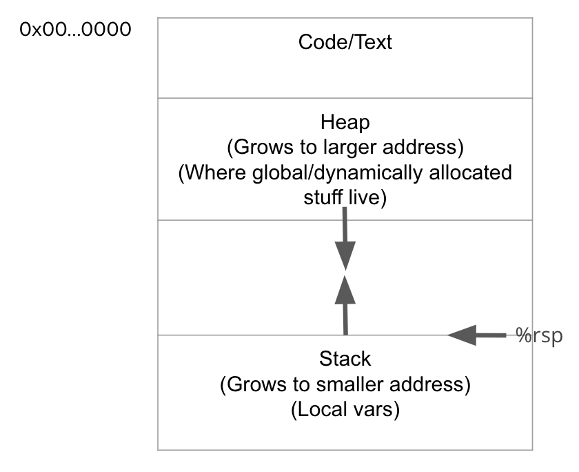
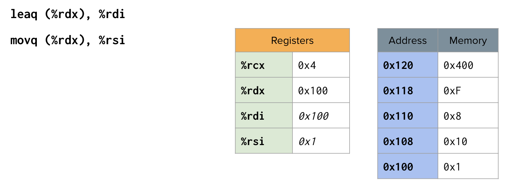

# CS 33 Notes

## Table of Contents
- [Lecture 1-3](#lecture-1-3)
- [Homework 1](#homework-1)
- [Discussion 1](#discussion-1)
- [Lecture 4-6](#lecture-4-6)
- [Homework 2](#homework-2)
- [Discussion 2](#homework-3)
- [Lecture 7-8](#lecture-7-8)
- [Homework 4](#homework-4)

## Lecture 1-3
- Bitwise operators
    - & AND: if both bits in the compared position are 1, the bit in the resulting binary representations is 1 (1 x 1 = 1); otherwise, the result is 0 (1 x 0 = 0 and 0 x 0 = 0)

    ```
        0101 (decimal 5)
    AND 0011 (decimal 3)
      = 0001 (decimal 1)
    ```

    - | OR: the result in each position is 0 if both bits are 0, while otherwise the result is 1

    ```
       0101 (decimal 5)
    OR 0011 (decimal 3)
     = 0111 (decimal 7)
    ```

    - ~ NOT: bits that are 0 become 1 and vice versa

    ```
    NOT 0111 (decimal 7)
      = 1000 (decimal 8)
    ```

    ```
    NOT 10101011 (decimal 171)
      = 01010100 (decimal 84)
    ```

    - ^ XOR: the result in each position is 1 if only one of the bits is 1, but will be 0 if both are 0 or both are 1

    ```
        0101 (decimal 5)
    XOR 0011 (decimal 3)
      = 0110 (decimal 6)
    ```
- Logical operators
    - && AND: if both operands are nonzero then the condition becomes true; otherwise, the result has a value of 0
        - 1 && 1 = 1
        - 1 && 0 = 0
        - 0 && 1 = 0
        - 0 && 0 = 0

    - || OR: if any one of the operands are nonzero then the condition becomes true; otherwise, the result has a value of 0
        - 1 || 1 = 1
        - 1 || 0 = 1
        - 0 || 1 = 1
        - 0 || 0 = 0
    
    - ! NOT: if the condition is true then the logical NOT operator will make it false and vice versa
        - !0 = 1
        - !1 = 0
    
- Shift operators
    - x << y Left shift
        - Shift bit-vector x left y positions
        - Throw away extra bits on left
        - Argument x:     01100010
            - `<< 3:       00010000`
            - `Log. >> 2   00011000`
            - `Arith. >> 2 00011000`
        - Shifting left by n positions is the same as multiplying by 2^n, even for negative numbers and with overflowing
    - x >> y Right shift
        - Shift bit-vector x right y positions
        - Throw away extra bits on right
        - Argument x:     10100010
            - `>> 3:       00010100`
            - `Log. >> 2   00101000`
            - `Arith. >> 2 11101000`
        - Logical
            - Does not sign-extend
            - Applies on unsigned int
            - Shifting right by n positions is the same as dividing by 2^n
            ```
            unsigned num = 0xCF00000F;

            num >> 4: 0x0CF00000
            num / 16: 0x0CF00000
            ```
        - Arithmetic
            - Sign is preserved
            - Applies on int
            - Not like division by powers of 2
                - Rounded towards -infinity instead of zero
            ```
            int num = 0xCF00000F; 

            num >> 4: 0xFCF00000
            num / 16: 0xFCF00001

            int num = -7;
            
            num >> 1: -4
            num / 2: -3
            ```
    - Logicial shift
        - Fill with 0's on right/left
    - Arithmetic shift
        - Replicate most significant bit on right/left
    - Undefined behavior
        - Shift amount < 0 or >= word size

- Encoding integers
    - Sign bit
        - For 2's complement, most significant bit indicates sign
        - 0 for nonnegative / positive
        - 1 for negative

- Numeric ranges
    - Unsigned values
        - UMin = 0 / 000...0
        - UMax = 2^w - 1 / 111...1
    - Two's complement values
        - TMin = -2^(w-1) / 100...0
        - TMax = 2^(w-1) - 1 / 011...1
    - Other values
        - Minus 1 / 111...1
    - Cheatsheet
        - 0 = 0x00 = 000...
        - -1 = 0xff = 111...
        - ~0 = -1
        - ~(-1) = 0
    - Common bit manipulation patterns
        - Negative of a number: `-c = ~c + 1`
        - Mask to 0/1 bit: `!!mask`
        - Mask from sign-bit: `num >> 31`
        - Getting a bit
        ```
        bool getBit(int num, int i)
        {
            int bit = ((1 << i) & num);
            return !!bit;
        }
        ```
        - Setting a bit
        ```
        bool setBit(int num, int i)
        {
            return ((1 << i) | num);
        }
        ```
        - Branches
        ```
        if(test)
            output = a;
        else
            output = b;
        ```
        ```
        mask = ((!!test << 31) >> 31);
        output = (mask & a) | (~mask & b);
        ```
    - |TMin| = TMax + 1
        - Asymmetric range
    - UMax = 2 * TMax + 1
    - Mapping between unsigned and two's complement numbers: keep bit representations and reinterpret
    - Signed vs unsigned in C
        - Constants
            - By default are considered to be signed integers
            - Unsigned if have "U" as suffix (Ex: 0U, 4294967259U)
        - Casting
            - Explicit casting between signed and unsigned same as U2T and T2U
            ```
            int tx, ty;
            unsigned ux, uy;
            tx = (int) ux;
            uy = (unsigned) ty;
            ```
    - If there is a mix of unsigned and signed in single expression, signed values implicitly cast to unsigned
        - Including comparison operators <, >, ==, <=, >=

- Assuming the following, which of the following statements are always true?
```
int x = rand();
int y = rand();
unsigned ux = unsigned(x);
unsigned uy = unsigned(y);
```
- `(x > 0) && (y > 0) => x * y > 0`: False. If either x or y is negative, then the left side of the && condition is false, and the right side is not evaluated. So, the overall result is false.
- `x > uy => x > 0`: False. x could also be equal to 0. 
- `(x^x)^x == y => x == y`: True. The XOR (^) operation with itself cancels out, so (x^x) is 0. Therefore, (0^x) is equivalent to x, and this statement is true.
- `(ux - uy) == x - y`: True. If y is non-negative, the conversion from signed to unsigned preserves the value, and the subtraction works as expected. If y is negative, the subtraction under modulo arithmetic still results in the same value.
- `(x << 32) >> 32 == x`: Undefined. Left-shifting a 32-bit integer by 32 bits is undefined behavior in C because it goes beyond the size of the integer. The result is not well-defined.

- Write a C function using only bitwise operators and “!”, to determine if the number given is non-negative. If the number is non-negative return 1 else 0.
```
int is_nonnegative(int x)
{
    return !(x >> 31);
}
```

- Write a C function using only bitwise operators to return the absolute value of a number. If the number is Tmin, just return Tmin since there is no positive representation of Tmin.
```
int my_abs(int x)
{
    int sign = x >> 31;
    return (x ^ sign) + (1 & sign); // multiply by -1 if the sign is negative
}
```

- Write a function sm2tc(int x), which converts an int from sign magnitude to two’s complement using only bitwise operations. Note that we will be using Little Endian convention and the MSB represents the signed bit.
    - Reminder: Sign magnitude works such that one bit (the MSB) represents the sign of the number while the rest of the bits represent the magnitude of the number.
    ```
    int sm2tc(int x)
    {
        int is_negative = x >> 31;
        int mask = ~(~0 << 31); // remove the sign bit
        return (is_negative) & (~(x & mask) + 1) | ~is_negative & x;
        // if it's not negative we can return the same number, else we return 2's complement
    }
    ```

<!-- - Definitions
    - Architecture (also ISA: instruction set architecture): the parts of a processor design that one needs to understand or write assembly/machine code
        - Examples: instruction set specification, registers
    - Microarchitecture: implementation of the architecture
        - Examples: cache sizes and core frequency
    - Code forms:
        - Machine code: the byte-level programs that a processor executes
        - Assembly code: a text representation of machine code
    - Example ISAs:
        - Intel: x86, IA32, Itanium, x86-64
        - ARM: Used in almost all mobile phones

- Programmer-Visible State
    - PC: Program counter
        - Address of next instruction
        - Called "RIP" (x86-64)
    - Register file
        - Heavily used program data
    - Condition codes
        - Store status information about most reent arithmetic or logical operation
        - Used for conditional branching 
    - Memory
        - Byte addressable array
        - Code and user data
        - Stack to support procedures

- Turning C into Object Code
    - Code in files `p1.c` and `p2.c`
    - Compile with the command: `gcc -0g p1.c p2.c -o p`
        - Use basic optimizations (`-0g`)
        - Put resulting binary in file `p`

- Assembly Characterisitics
    - Data Types
        - "Integer" data of 1, 2, 4, or 8 bytes
            - Data values
            - Addresses (untyped pointers)
        - Floating point data of 4, 8, or 10 bytes
        - Code: byte sequences encoding series of instructions
        - No aggregate types such as arrays or structures
            - Just contiguously allocated bytes in memory
    - Operations
        - Perform arithmetic function on register or memory data
        - Transfer data between memory and register
            - Load data from memory into register
            - Store register data into memory
        - Transfer control
            - Unconditional jumps to/from procedures
            - Conditional branches 

- Object code
    - Assembler
        - Translates .s into .o
        - Binary encoding of each instruction
        - Nearly-complete image of executable code
        - Missing linkages between code in different files
    - Linker
        - Resolves references between files
        - Combines with static run-time libraries
            - E.g., code for `malloc`, `printf`
        - Some libraries are dynamically linked
            - Linking occurs when program begins execution
    - Disassembler
        - `objdump -d sum`
        - Useful tool for examining object code
        - Analyzes bit pattern of series of instructions
        - Produces approximate rendition of assembly code
        - Can be run on either `a.out` (completely executable) or `.o` file
        - Within gdb debugger
            - `gdb sum`
            - `disassemble sumstore`
                - Disassemble procedure
            - `x/14xb sumstore`
                - Examine the 14 bytes starting at `sumstore`
        - What can be disassembled?
            - Anything that can be interpreted as executable code
            - Disassembler examines bytes and reconstructs assembly source

        - Operand types
        - Immediate: constant integer data
            - Example: `$0x400`, `$-533`
            - Like C constant, but prefixed with `$`
            - Encoded with 1, 2, or 4 bytes
        - Register: one of 16 integer registers
            - Example: `%rax`, `%r13`
            - But `%rsp` reserved for special use
            - Others have special uses for particular instructions
        - Memory: 8 consecutive bytes of memory at address given by register
            - Simplest example: `(%rax)`
            - Various other "address modes" -->

## Homework 1

2.71

a. The code won’t work for negative numbers. 0xFF will translate to 000…11111111, and as a result, you won’t be able to return a negative number due to the & operation zeroing out the result.

b. 4 signed bytes are packed into a 32-bit unsigned. Bytes within the word are numbered from 0 (least significant) to 3 (most significant). Extract the designated byte and return as signed integer.

```
int xbyte(packed_t word, int bytenum)
{
    return (word << ((3 - bytenum) << 3)) >> 24;
}
```

`(3 - bytenum)`: This expression calculates the difference between 3 (the index of the most significant byte in a 32-bit word) and bytenum. This result determines how many bytes we need to shift to reach the desired byte.

`((3 - bytenum) << 3)`: This part left-shifts the result by 3 positions, effectively converting the byte index to bit positions. Each byte is 8 bits, so shifting by 3 is equivalent to multiplying by 8.

`(word << ((3 - bytenum) << 3))`: This left-shifts word by the calculated bit position, effectively moving the desired byte to the least significant byte position.

`>> 24`: This right-shifts the result by 24 positions. Since we are working with a 32-bit word, right-shifting by 24 positions effectively discards the least significant 24 bits, leaving only the desired byte in the least significant byte position.

2.82

Indicate whether or not the expression always yields 1. If so, describe the underlying mathematical principles. Otherwise, give an example of arguments that make it yield 0.

a. `(x<y) == (-x>-y)`: No. If x is INT_MIN, the negative value of INT_MIN will wrap around because the absolute value of INT_MIN is one less than INT_MIN meaning INT_MIN = -INT_MIN (integer overflow). So if y is a number like -42 INT_MIN is not greater than -42.

b. `((x+y)<<4) + y-x == 17*y+15*x`: Yes. Shifting left by 4 multiplies (x+y) by 16 and then adding y and subtracting x gives you 16x + 16y + y - x = 15x + 17y = 17y + 15x.

c. `~x+~y+1 == ~(x+y)`: Yes. The left side = (-x - 1) + (-y - 1) + 1 which is equal to -x - y - 1. 

d. `(ux-uy) == -(unsigned)(y-x)`: Yes. Distribute the unsigned and negative sign on the right side to obtain -(uy-ux) = ux-uy.

e. `((x>>2) << 2) <= x`: Yes. For positive numbers, x ends up at the same value. However, for negative numbers, the end result will be less than x due to the arithmetic right shift.

## Discussion 1

1. Assume:
int x = rand();
int y = rand();
unsigned ux = (unsigned) x;

Are the following statements always true?

a. `ux >> 3 == ux/8`: Yes. For unsigned integers, right shifting always rounds towards 0, as all unsigned integers are non-negative and extra 1's on the right are discarded while right shifting. Thus, shifting to the right by 3 is equivalent to integer division by 2^3, which also rounds towards 0.

<!-- Yes. Shifting right by 3 is the same as dividing by 8, since it is an unsigned integer. -->

b. `given x > 0, ((x << 5) >> 6) > 0`: No. In the case where (x << 5) has a 1 for its most significant bit, right shifting by 6 will produce a negative number. 

<!-- No. If the left most bit (?) is 1 when after you left shift and before you right shift, x will end up being negative, thus smaller than 0. -->

c. `~x + x >= ux`: Yes. ~x + x would be UMAX.

<!-- Yes. (-x - 1) + x = -1 >= ux. -1 will be converted to the maximum representable value of the unsigned type, so they'll always be equal. -->

d. `given x & 15 == 11, ( ~((x >> 3) & (x >> 2)) << 31) >= 0`: No. The final comparison against 0 effectively checks if the most significant bit of the left hand sign is 0 or not. By the given statement, we know that the 4 least significant bits (lsb) of x are 1011. Thus (x >> 3) has a lsb of 1, while (x >> 2) has a lsb of 0.

AND-int the two together has a lsb of 0, which when negated is 1. Left-shifting by 31 thus results in a number with a most significant bit of 1, and the remaining bits being 0. This is a negative number.

<!-- No.
x = 00001011 = 11
00001111
00001011

~((00000001) & (00000010)) << 31
~(00000000) << 31
11111111 << 31
will be negative, so it'll be less than 0. -->

e. `given ((x < 0) && (x + x < 0)), x + ux < 0`: No. In an addition of an unsigned integer with a signed integer, the signed integer is implicitly cast to unsigned. Thus, the addition of two unsigned integers will always be non-negative.

<!-- No. Adding an unsigned integer to x will never make the result negative, since unsigned integers cannot represent negative numbers. -->

f. `given ((x < 0) && (y < 9) && (x + y) > 0)), ((x | y) >> 30) == -1`: No. Per the given, we know that the two most significant bits of x and y can be either 10 and 10, 11 and 10, or 10 and 11. In the case where x and y are 10 and 10, (x | y) would have most significant bits of 10. In that case, right shifting (x | y) by 30 would result in -2. 

<!-- No. x is a negative number, y is less than 9, x must be -8 < x < -1 and 2 < y < 9. x will always be 1.. and y will be 0... If you use the or operation, the resulting bit will start with 1, so if you shift it to the right by 30, it will not equal -1. -->

2. Given: x has a 4 byte value of 255, what is the value of the byte with the lowest address in a...

a. big endian system? (most significant value in the sequence is stored at the lowest storage address): 0x00

b. little endian system? (least significant value in the sequence is stored at the lowest storage address): 0xFF

## Lecture 4-6
- Machine programming
    - Moving data: `movq source, dest`
    - `leaq source, dest`
        - Computing address without a memory reference
            - E.g., translation of `p = &x[i]`
        - Computing arithmetic expressions of the form x + k*y
            - k = 1, 2, 4, or 8
        - Sets dest to address computed at source
    - `addq source, dest`: dest = dest + source
    - `subq source, dest`: dest = dest - source
    - `imulq source, dest`: dest = dest * source
    - `salq source, dest`: dest = dest << source (aka shlq)
    - `sarq source, dest`: dest = dest >> source (arithmetic)
    - `shrq source, dest`: dest = dest >> source (logical)
    - `xorq source, dest`: dest = dest ^ source
    - `andq source, dest`: dest = dest & source
    - `orq source, dest`: dest = dest | source
    - `incq dest`: dest = dest + 1
    - `decq dest`: dest = dest - 1
    - `negq dest`: dest = -dest
    - `notq dest`: dest = ~dest
    - `cmpq src2, src1`
        - `cmpq b, a`: like computing `a-b` without setting destination
        - `CF set` if carry out from most significant bit (used for unsigned comparisons)
        - `ZF set` if `a == b`
        - `SF set` if `(a-b) < 0` (as signed)
        - `OF set` if two's-complement (signed) overflow
    - `testq src2, src1`
        - `testq b, a` like computing `a&b` without setting destination
        - Sets condition codes based on value of src1 & src2
        - Useful to have one of the operands be a mask
        - `ZF set` when `a&b == 0`
        - `SF set` when `a&b < 0`
    - `retq`
        - "Return"
        - Returns from a function
    - Assembly lingo
        - b: byte (1 byte, 8 bits)
        - w: word (2 bytes, 16 bits)
        - l: long (4 bytes, 32 bits)
        - q: quad (8 bytes, 64 bits)
        - Floating-points
            - s: (4 bytes, 32 bits)
            - l: (8 bytes, 64 bits)
    - Data sizes
        - char: 1 byte
        - short: 2 bytes
        - int, float: 4 bytes
        - double, long, pointers: 8 bytes
        - long double: 16 bytes

- Double check lecture 4 content:
    - C control
        - if-then-else
        - do-while
        - while, for
        - switch
    - Assembler control
        - Conditional jump
        - Conditional move
        - Indirect jump (via jump tables)
        - Compiler generates code sequence to implement more complex control
    - Standard techniques
        - Loops converted to do-while or jump-to-middle form
        - Large switch statements use jump tables
        - Sparse switch statements may use decision trees (if-elseif-elseif-else)

- Condition flags
    - CF: carry flag
    - ZF: zero flag
    - SF: sign flag
    - OF: overflow flag
    - Implicitly set by arithmetic operations
    - Explicitly set by `cmp` and `test`
        - `cmp b, a` => `a - b`
        - `test b, a` => `a & b`

- Conditional move
    - `cmove S, D`
    - Example:
        - `testq %rdi, %rdi`
        - `cmove %rdx, %rax`
        - Equivalent C code:
        ```
        v = then-expr;
        ve = else-expr;
        t = test-expr;
        if (!t) v = ve;
        ```

- Jumps
    - `je`: jump if equal
    - `jne`: jump if not equal
    - `js`: jump if signed
    - `jns`: jump if not signed
    - `jg`: jump if greater (signed)
    - `jge`: jump if greather than or equal to (signed)
    - `jl`: jump if less (signed)
    - `jle`: jump if less than or equal to (signed)
    - `ja`: jump if above (unsigned)
    - `jb`: jump if below (unsigned)

- If statements
```
0x400572 <+0>: 	cmp  $0x6,%edi
0x400575 <+3>: 	jg  0x40057d <func0+11>
0x400577 <+5>: 	mov	$0x0,%eax
0x40057c <+10>:	ret
0x40057d <+11>:	mov	$0x6,%eax
0x400582 <+16>:	ret
```
```
if (a > 6)
    return 6;
 return 0;
```

- Loops
```
...
0x400589 <+6>: 	mov	%edi,%ebp
0x40058b <+8>: 	mov	$0x0,%ebx
0x400590 <+13>:	jmp	0x4005a6 <func1+35>
0x400592 <+15>:	mov	%ebx,%esi
0x400594 <+17>:	mov	$0x4006b4,%edi
0x400599 <+22>:	mov	$0x0,%eax
0x40059e <+27>:	call     0x400460 <printf@plt>
0x4005a3 <+32>:	add	$0x1,%ebx
0x4005a6 <+35>:	cmp	%ebp,%ebx
0x4005a8 <+37>:	jl 	0x400592 <func1+15>
0x4005aa <+39>:	mov	$0x0,%eax
0x4005af <+44>:	add	$0x8,%rsp
...
0x4005b5 <+50>:	ret
```
```
int i = 0;
while(i < a) {
    printf("%d", i);
    i++;
}
return 0;
```

- Switch statements
```
0x4005b6 <+0>: 	sub	$0x64,%edi
0x4005b9 <+3>: 	cmp	$0x7,%edi
0x4005bc <+6>: 	ja 	0x4005df <func2+41>
0x4005be <+8>: 	mov	%edi,%edi
0x4005c0 <+10>:	jmp	*0x4006b8(,%rdi,8)
0x4005c7 <+17>:	mov	$0x1,%eax
0x4005cc <+22>:	ret
0x4005cd <+23>:	mov	$0x3,%eax
0x4005d2 <+28>:	ret
0x4005d3 <+29>:	mov	$0x4,%eax
0x4005d8 <+34>:	ret
0x4005d9 <+35>:	mov	$0x5,%eax
0x4005de <+40>:	ret
0x4005df <+41>:	mov	$0x0,%eax
0x4005e4 <+46>:	ret
0x4005e5 <+47>:	mov	$0x2,%eax
0x4005ea <+52>:	ret
```
```
switch(a) {
    case 100:
    case 102:
        return 1;
    case 103:
        return 2;
    case 104:
        return 3;
    case 106:
        return 4;
    case 107:
        return 5;
    default:
        return 0;
}
```
```
0x4006b8:   	0xc7		0x05	0x40	0x00	0x00	0x00	0x00	0x00
0x4006c0:   	0xdf		0x05	0x40	0x00	0x00	0x00	0x00	0x00
0x4006c8:   	0xc7		0x05	0x40	0x00	0x00	0x00	0x00	0x00
0x4006d0:   	0xe5		0x05	0x40	0x00	0x00	0x00	0x00	0x00
0x4006d8:   	0xcd		0x05	0x40	0x00	0x00	0x00	0x00	0x00
0x4006e0:   	0xdf		0x05	0x40	0x00	0x00	0x00	0x00	0x00
0x4006e8:   	0xd3		0x05	0x40	0x00	0x00	0x00	0x00	0x00
0x4006f0:   	0xd9		0x05	0x40	0x00	0x00	0x00	0x00	0x00
```

- x86-64 stack
    - The stack
        - Stores local variables
        - Enter a new "stack frame" whenever you enter a new function
        - Grows by decrementing `%rsp` (`pushq`)
        - Shrinks by incrementing `%rsp` (`popq`)
    
    - Region of memory managed with stack discipline
    - Grows toward lower addresses
    - Registers
        - Small hardware-based storage devices closest to the GPU that generally store addresses into physical memory
        - `%rax`: Return value
        - `%rsp`: Stack pointer (lowest stack address, top of "top" element)
        - `%rdi`, `%rsi`, `%rdx`, `%rcx`, `%r8`, %`r9`: Store the 1st-6th argument passed to a function call
        - `%r10`, `%r11`: Caller-saved registers
            - After a `callq` instruction, their values might be different
            - The caller needs to save their values if these registers are holding data
        - `%rbx`, `%rbp`, `%r12`, `%r13`, `%r14`, `%r15`: Callee-saved registers
            - Before exiting a function call, ensure that the values in these registers did not change
    - `pushq src`
        - Fetch operand at src
        - Decrement %rsp (stack pointer) by 8 
        - Write operand at address given by %rsp (place the value)
    - `popq dest`
        - Read value at address given by %rsp (extract the value)
        - Increment %rsp (stack pointer) by 8
        - Store value at dest (must be register)
    - Stack is the right data structure for procedure call / return
        - If P calls Q, then Q returns before P
        - Usage of `call` and `ret`:
        - Implements a subroutine `call` and `return`
        - `call`: Saves a return address, then jumps to the lcoation of the callee function
            - Pushes the current code location onto the hardware supported stack in memory
            - Performs an unconditional jump to the code location indicated by the label operand
            ```
            call <label>:
                pushq %rip // %rip points to the next instruction to be executed
                jump <label>
            ```
        - `ret`: Uses the previously saved return address to jump back to the caller function
            - Transfers program control to a return address located on the top of the stack
        - Call stack
            - Stack grows when more items are added to its "top"
            - Pushing on the stack grows it
            - Stack grows in the direction of decreasing address
            - Pushing on the stack = decrementing the stack pointer

- Assembly to C


- Memory addressing modes
    - General form: `D(Rb, Ri, S)`
        - D is a constant displacement that can be as wide as 32-bits
        - Rb is the base register, which is any of the 16 integer registers
        - Ri is the index register, which can be any register except for %rsp
        - S is the scale (can only be 1, 2, 4, or 8)
    - Translates to `MEM[D + R_EG[Rb] + R_EG[Ri]*S]`

    - Consider the following instruction: `movq $10, -8(%rax, %rdx, 4)`
        - We're applying the `movl` instruction, which is responsible for moving (or copying) a value from one memory location to another
        - We're moving the immediate value `$10`
            - We know that it's an immediate because it is prepended by a `$` sign
            - An immediate is like a constant
        - We're moving the immediate into a memory location, `MEM[REG[%rax]+4*REG[%rdx]+(-8)]`
        - We know that it's a memory location because of the parentheses!
    - Let's consider the following instruction: `leaq source, destination`
        - `leaq`, or load effective address, does exactly as its name suggests
        - The instruction takes a memory address expressed through the parameters (D, Rb, Ri, S) and, rather than returning the value at the address, returns the address itself
        - This in contrast with `movq`, which moves the contents of a specific address

- Suppose we have `leaq D(Rb, Ri, S), %rbx` and that our variable N is in the register of %rax. What values K*N can we produce with the `leaq` instruction? (Where K is some integer.)
    - If we use the form `(, %rax, S)` we can produce N, 2N, 4N, and 8N
    - If we use the form `(%rax, %rax, S)`, we can take advantage of the adding of the first parameter and produce 3N, 5N, and 9N
    
    

- Procedure control flow
    - Use stack to support procedure call and return
    - Procedure call: call label
        - Push return address on stack
        - Jump to label
    - Return address:
        - Address of the next instruction right after call
        - Example from disassembly
    - Procedure return: ret
        - Pop address from stack
        - Jump to address
    - Recursion and mutual recursion handled by normal calling conventions
        - Can safely store values in local stack frame and in callee-saved registers
        - Put function arguments at top of stack
        - Result return in %rax
    - Pointers are addresses of values
        - On stack or global

- Arrays
    - Basic principle
        - T A[L];
        - Array of data type T and length L
        - Contiguously allocated region of L * sizeof(T) bytes in memory
        - Identifier A can be used as a pointer to array element 0: Type T*
    - Accessing example:
    ```
    # %rdi = z (starting address of array)
    # %rsi = digit (array index)
    movl(%rdi, %rsi, 4), %eax # z[digit], desired digit at %rdi + 4 * %rsi, use memory reference
    ```
    - Incrementing example:
    ```
    addl $1, (%rdi, %rax, 4) # z[i]++
    ```
    - Multidimensional (nested) arrays
        - T A[R][C];
            - 2D array of data type T
            - R rows, C columns
            - Example: `int myArray[3][3]`
        - Type T element requires K bytes
        - Array size: R * C * K bytes
        - Continuous memory
        - Arrangement: row-major ordering (elements are listed horizontally in one row continuously)
        - Row access
            - Row vectors
                - A[i] is array of C elements
                - Each element of type T requires K bytes
                - Starting address A + i * (C * K)
            - Accessing example:
            ```
            # %rdi = index
            leaq(%rdi, %rdi, 4), %rax # 5 * index
            leaq pgh(, %rax, 4), %rax # pgh + (20 * index)
            ```
                - Row vector
                    - pgh[index] is array of 5 ints
                    - Starting address pgh + 20 * index
                - Machine code
                    - Computes and returns address
                    - Compute as pgh + 4 * (index + 4 * index)
        - Element access
            - Array elements
                - A[i][j] is element of type T, which requires K bytes
                - Address A + i * (C * K) + j * K = A + (i * C + j) * K
            - Accessing example:
            ```
            int get_pgh_digit(int index, int dig)
            {
                return pgh[index][dig];
            }

            leaq (%rdi, %rdi, 4), %rax # 5 * index
            addl %rax, %rsi            # 5 * index + dig
            movl pgh(, %rsi, 4), %eax  # M[pgh + 4 * (5 * index + dig)]
            ```
                - Array elements
                    - pgh[index][dig] is int
                    - Address: pgh + 20 * index + 4 * dig = pgh + 4 * (5 * index + dig)
    - Multi-level arrays
        - Array of pointers to arrays
        - Example: `int myArray2[3]*`

- Alignment principles
    - Aligned data
        - Primitive data type requires K bytes
        - Address must be multiple of K
        - Required on some machines; advised on x86-64
    - Motivation for aligning data
        - Memory accessed by (aligned) chunks of 4 or 8 bytes (system dependent)
            - Inefficient to load or store datum that spans quad word boundaries
            - Virtual memory trickier when datum spans 2 pages
    - Compiler
        - Inserts gaps in structure to ensure correct alignment of fields

- Struct
    - Structs are always aligned by the largest data member they contain
    - If they contain multiple data members of different sizes, the smaller sized values are "padded" with extra bytes until they also uphold the alignment property
    - The order in memory of the data members in the struct is the same order as defined in the code
    - If x is the starting address of a struct, then a data member of size 4 would start at either x, x+4, x+8, x+12...
    - How big is this struct in bytes? (Assume 64-bit architecture)
    ```
    struct westeros
    {
        char lannister; // 1 byte, plus 7 bytes of padding
        double* stark; // 8 bytes (pointer)
        short frey; // 2 bytes, plus 6 bytes of padding
        // total size: 24 bytes
    }
    ```
    
    ```
    struct westeros
    {
        char lannister; // 1 byte, plus 1 byte of padding
        short frey; // 2 bytes, plus 4 bytes of padding
        double* stark; // 8 bytes (pointer)
        // total size: 16 bytes
    }
    ```
    
    ```
    struct e {
        union // 8 bytes
        { 
            char b[6];
            char c[4]; 
            int k;
        } d;
        char a; // 1 byte, plus 3 bytes of padding (to the int)
    };
    ```
    
- Specific cases of alignment (x86-64)
    - 1 byte: char, ...
        - No restrictions on address
    - 2 bytes: short, ...
        - Lowest 1 bit of address must be 0_2
    - 4 bytes: int, float, ...
        - Lowest 2 bits of address must be 00_2
    - 8 bytes: double, long, char *, ...
        - Lowest 3 bits of address must be 000_2
    - 16 bytes: long double (GCC on Linux)
        - Lowest 4 bits of address must be 0000_2

## Homework 2

3.60

a. x: %rdi, n: %rsi, result: %rax, mask: %rdx

b. result: 0, mask: 1

c. mask != 0

d. mask = mask << n

e. result |= (x & mask)

f. 
``` 
long loop(long x, int n) {
    long result = 0;
    long mask;
    for (mask = 1; mask != 0; mask = mask << n) {
        result |= (x & mask);
    }
    
    return result;
}
```

Notes:
- %ecx is loop counter variable
- %rsp is stack pointer 
- %rip is next instruction pointer
- jne: jump if not equal
- %rax and %eax are diff bit versions of %ax
- %rdx and %edx are diff bit versions of %dx
- 0x4b(%rdi) = %rdi + 0x4b
- ,%rdi,8 = %rdi * 8

```
long loop (long x, int n)
x in %rdi, n in %esi, %rax is result

loop:
    movl    %esi, %ecx    // move %esi to %ecx, assign %ecx as x0, x0 = n
    movl    $1,   %edx    // move $1 to %edx, mask = 1 -> know %edx is mask bc of .L2 %rdx + provided code
    movl    $0,   %eax    // move $0 to %eax, result = 0 
    jmp     .L2

.L3:
    movq    %rdi, %r8     // move %rdi to %r8, assign %r8 as x2, x2 = x
    andq    %rdx, %r8     // %r8 = %r8 & %rdx, x2 = x2 & mask = x & mask
    orq     %r8,  %rax    // %rax = %rax | %r8, result = result | x2, SAME AS: result = result | (x & mask)
    salq    %cl,  %rdx    // %rdx = %rdx << %cl, %cl part of %rcx/%ecx = n, mask = mask << n 

.L2:
    testq   %rdx, %rdx    // checks rdx&rdx, sets a condition flag  
    jne     .L3           // jump to .L3 if not equal/not zero -> know it's zero bc rdx&rdx = 0
    rep; ret              // repeat until zero, return
```

```
long loop (long x, int n)
{
    long result = ______;
    long mask;
    for (mask = ____; mask ____; mask = ____) {
        result |= ________;
    }
    return result;
}
```

``` 
long loop(long x, int n) {
    long result = 0;
    long mask;
    for (mask = 1; mask != 0; mask = mask << n) {
        result |= (x & mask);
    }
    
    return result;
}
```

3.63

```
x in %rdi, n in %rsi, result in %rax
00000000004004f0 <switch_prob>:
  400590:       48 83 ee 3c             sub    $0x3c,%rsi                  // %rsi = %rsi - 60, n = n - 60
  400594:       48 83 fe 05             cmp    $0x5,%rsi                   // if n - 60 is ABOVE 5, we jump to default. the only cases left are 0,1,2,3,4,5. ->?
  400598:       77 29                   ja     400523 <switch_prob+0x33>   // for default (when n is above 5), jump to 400523
  40059a:       ff 24 f5 c0 05 40 00    jmpq   *0x4005c0(,%rsi,8)          // jump table at 0x4005c0
  4005a1:       48 8d 04 fd 00 00 00    lea    0x0(,%rdi,8),%rax           // result = 8 * x
  4005a8:       00 
  4005a9:       c3                      retq   
  4005aa:       48 89 f8                mov    %rdi,%rax                   // result = x
  4005ad:       48 c1 f8 03             sar    $0x3,%rax                   // result = result >> 3;
  4005b1:       c3                      retq   
  4005b2:       48 89 f8                mov    %rdi,%rax                   // result = x;
  4005b5:       48 c1 e0 04             shl    $0x4,%rax                   // result = result << 4;
  4005b9:       48 29 f8                sub    %rdi,%rax                   // result = result - x;
  4005bc:       48 89 c7                mov    %rax,%rdi                   // x = result
  4005bf:       48 0f af ff             imul   %rdi,%rdi                   // x = x * x
  4005c3:       48 8d 47 4b             lea    0x4b(%rdi),%rax             // default case: result = x + 75 -> how do you know this is default case
  4005c7:       c3                      retq   
```

```
(gdb) x/6gx 0x4006f8

0x4006f8:     0x00000000004005a1    0x00000000004005c3          // from this table, we can see we have a TOTAL of 6 cases, not including
0x400708:     0x00000000004005a1    0x00000000004005aa             any fall throughs or skipped cases. 
0x400718:     0x00000000004005b2    0x00000000004005bf
```

The jump table shows us the total number of cases we have for the switch statement. We can use the addresses to find where each case begins
in the assembly code. In addition, the cases go in order from top left to right. Any case that jumps to the default means it is SKIPPED
in the C code. The cases end with a "break" wherever there is a "retq" in the assembly code; otherwise, it is a fallthrough

```
long switch_prob(long x, long n) {
    long result = x;
    switch(n) {
        case 60: 
          result = 8 * x;
          break;
        case 62:              // case 61 is skipped because 0x4005c3 in jump table refers to default case == SKIPPED case
          result = 8 * x;     // notice this has the same assembly code as case 60!
          break;
        case 63:
          result = x;
          result = result >> 3;
          break;
        case 64:
          result = x;
          result = result << 4;
          result = result - x;
          x = result;
        case 65:
          x = x * x;
         default:
            result = x + 75;
    }
}
```

```
long switch_prob(long x, long n) {
    long result = x;
    switch(n) {
        case 60: 
        case 62:
            result = 8 * x;
            break;
        case 63: 
            result = x;
            result = result >> 3;
            // probably result = x >> 3;
            break;
        case 64:
            result = x;
            result = result << 4;
            result = result - x;
            x = result;
            // maybe x = (x << 4) - x;
        case 65:
            x = x * x;
        default: 
            result = x + 75;
    }

    return result;
}
```

## Homework 3

If the application were to output the value of magic8ball[3][4] – what would it be? i.e. what would be returned from the statement printf(“%s”, magic8ball[3][4]); 

magic8ball is a 3D array of characters size 1 byte, that is 8x8x8 in size. It starts at memory address 0x7fffffffe000 as denoted by the $1. To find the address of the first character in the array magic8ball[3][4] and eventually the output, we follow these steps:
- Start at the base address 0x7fffffffe000
- Add 3 * 8 * 8 (3 2D arrays, [3], 8 bytes is the size of each element in the array)
- Add 4 * 8 (4 1D arrays, [4], 8 bytes is the size of each element in the array)
- End up at 0x7fffffffe0e0 (3 * 8 * 8 + 4 * 8 = 224 bytes / 8 = 28 columns)
- The eight characters starting from that address are 0x57 0x72 0x6f 0x6e 0x67 0x00 0x00 0x00
- Using the ASCII table (HEX), the characters correspond to W r o n g Null Null Null
- "Wrong" would be returned from the printf statement

Note: magic8ball is an array of strings, and the strings are arrays of characters. Therefore, magic8ball[3][4] is looking for a specific string within the array of strings.

## Lecture 7-8
- x86-64 Linux memory layout
    - Stack
        - Runtime stack (8MB limit)
        - E.g., local variables
    - Heap
        - Dynamically allocated as needed
        - When call malloc(), calloc(), new()
    - Data
        - Statiscally allocated data
        - E.g., global vars, static vars, string constants
    - Text / Shared libraries
        - Executable machine instructions
        - Read-only
- Buffer overflow
    - When exceeding the memory size allocated for an array
    - #1 technical cause of security vulnerabilities
    - Most common form
        - Unchecked lengths on string inputs
        - Particularly for bounded character arrays on the stack
            - Sometimes referred to as stack smashing
- Worm
    - A program that can run by itself and can propagate a fully working version of itself to other computers
- Virus
    - Code that adds itself to other programs
    - Does not run independently
- Avoid overflow vulnerabilities in code
    - Use library routines that limit string lengths
        - `fgets` instead of `gets`
        - `strncpy` instead of `strcpy`
        - Don't use `scanf` with %s conversion specification
            - Use `fgets` to read the string
            - Or use %ns where n is a suitable integer
- System-level protections can help
    - Randomized stack offsets
        - At start of program, allocate random amount of space on stack
        - Shifts stack addresses for entire program
        - Makes it difficult for hacker to predict beginning of inserted code
    - Nonexecutable code segments
        - In traditional x86, can mark region of memory as either "read-only" or "writeable"
            - Can execute anything readable
        - x86-64 added explicit "execute" permission
        - Stack marked as non-executable
- Stack canaries can help
    - Idea
        - Place special value ("canary") on stack just beyond buffer
        - Check for corruption before exiting function
    - GCC Implementation
        - `-fstack-protector`
        - Now the default (disabled earlier)
- Union allocation
    - Allocate according to largest element
    - Can only use one field at a time
- Byte ordering
    - Idea
        - Short/long/quad words stored in memory as 2/4/8 consecutive bytes
        - Which byte is the most (least) significant?
        - Can cause problems when exchanging binary data between machines
    - Big endian
        - Most significant byte has lowest address
        - Least significant byte has highest address
        - Sparc
    - Little endian
        - Least significant byte has lowest address
        - Intel x86, ARM Android and IOS
    - Bi Endian
        - Can be configured either way
        - ARM
    ```
    0x100 | 0x108 | 0x110 | 0x118
    01    | 23    | 45    | 67      big endian
    67    | 45    | 23    | 01      little endian
    ```
- Summary of compound types in C
    - Arrays
        - Contiguous allocation of memory
        - Aligned to satisfy every element's alignment requirement
        - Pointer to first element
        - No bounds checking
    - Structures
        - Allocate bytes in order declared
        - Pad in middle and at end to satisfy alignment
    - Unions
        - Overlay declarations
        - Way to circumvent type system
- Fractional binary numbers
    - Representation
        - Bits to right of "binary point" represent fractional powers of 2
        - b_2 = 4, b_1 = 2, b_0 = 1, b_-1 = 1/2, b_-2 = 1/4
        - 5 3/4 = 101.11_2
        - 2 7/8 = 10.111_2
        - 1 7/16 = 1.0111_2
    - Observations
        - Divide by 2 by shifting right (unsigned)
        - Multiply by 2 by shifting left
        - Numbers of form 0.1111..._2 are just below 1.0
            - 1/2 + 1/4 + 1/8 + ... + 1/2^8 + ... -> 1.0
            - Use notation 1.0 - e
    - Representable numbers
        - Limitation #1
            - Can only exactly represent numbers of the form x/2^k
            - Other rational numbers have repeating bit representations
            - 1/3 = 0.0101010101[01]..._2
            - 1/5 = 0.001100110011[0011]..._2
            - 1/10 = 0.0001100110011[0011]..._2
        - Limitation #2
            - Just one setting of binary point within the w bits
                - Limited range of numbers
- Floating point representation
    - Numerical form: (-1)^s M 2^E
        - Sign bit s determines whether number is negative or positive
        - Significand M normally a functional value in range [1.0,2.0]
        - Exponent E weights value by power of two
    - Encoding
        - MSB s is sign bit s
        - exp field encodes E (but is not equal to E)
        - frac field encodes M (but is not equal to M)
        - s | exp | frac
    - Precision options
        - Single precision: 32 bits
            - s (1) | exp (8-bits) | frac (23-bits)
        - Double precision: 64 bits
            - - s (1) | exp (11-bits) | frac (52-bits)
        - Extended precision: 80 bits (Intel only)
            - s (1) | exp (15-bits) | frac (63/4-bits)
    - "Normalized" values
        - When exp DNE 000...0 and exp DNE 111...1
        - Exponent coded as a biased value: E = Exp - Bias
        - Exp: unsigned value of exp field
        - Bias = 2^(k-1) - 1, where k is number of exponent bits
            - Single precision: 127 (Exp: 1...254, E: -126...127)
            - Double precision: 1023 (Exp: 1...2046, E: -1022...1023)
        - Significand coded with implied leading 1: M = 1.xxx...x_2
            - xxx...x: bits of frac field
            - Minimum when frac=000...0 (M = 1.0)
            - Maximum when frac=111...1 (M = 2.0 - E)
            - Get extra leading bit for "free"
        - Example: 
            - v = (-I^2) M 2^E
            - E = Exp - Bias
            - Value: float F = 15213.0;
            - 15213_10 = 11101101101101_2 = 1.1101101101101_2 * 2^13
            - Significand
                - M = 1.1101101101101_2
                - frac = 11011011011010000000000_2
            - Exponent
                - E = 13
                - Bias = 127
                - Exp = 140 = 10001100_2
            - Result
                - 0 (s) | 10001100 (exp) | 11011011011010000000000 (frac)
    - Denormalized values
        - v = (-I)^s M 2^E
        - E = 1 - bias
        - Condition: exp = 000...0
        - Exponent value: E = 1 - bias (instead of E = 0 - bias)
        - Significant coded with implied leading 0: M = 0.xxx...x_2
            - xxx...x: bits of frac
        - Cases
            - exp = 000...0, frac = 000...0
                - Represents zero value
    - Special values
        - Condition: exp = 111...1
        - Case: exp = 111...1, frac = 000...0
            - Represents value infinity
            - Operation that overflows
            - Both positive and negative
            - E..g., 1.0/0.0 = -1.0/-0.0 = infinity, 1.0/-0.0 = -infinity
        - Case: exp = 111...1, frac DNE 000...0
            - Not-a-Number (NaN)
            - Representa case when no numeric value can be determined
            - E.g. sqrt(-1), infinity - infinity, infinity * 0
    - Tiny floating point example
        - s (1) | exp (4-bits) | frac (3-bits)
        - 8-bit floating point representation
            - The sign bit is in the most significant bit
            - The next four bits are the exponent, with a bias of 7
            - THe last three bits are the frac
- Floating point operations
    - x +f y = Round(x + y)
    - x *f y = Round(x * y)
    - Basic idea
        - First compute exact result
        - Make it fit into desire precision
            - Possibly overflow if exponent too large
            - Possibly round to fit into frac
- Rounding binary numbers
    - Binary fractional numbers
        - "Even" when least significant bit is 0
        - "Half way" when bits to right of rounding position = 100..._2
- Floating point in C
    - C guarantees two levels
        - float: single precision
        - double: double precision
    - Conversions/casting
        - Casting between int, float, and double changesbit representation
        - double/float -> int
            - Truncates fractional part
            - Like rounding toward zero
            - Not defined when out of range or NaN: generally sets to TMin
        - int -> double
            - Exact conversion, as long as int has <= 53 bit word size
        - int -> float
            - Will round according to rounding mode
            
## Homework 4

3.70

a. 
What are the offsets (in bytes) of the following fields:
```
union ele {
    struct {
        long *p;
        long y;
    } e1;

    struct {
        long x;
        union ele *next;
    } e2;
};
```
e1.p: 0 bytes (first field in the structure)

e1.y: 8 bytes (size of long *p because it comes after p, long = 8 bytes)

e2.x: 0 bytes (first field in the second structure)

e2.next: 8 bytes (size of long x because it comes after x)

b. 16 bytes

How many total bytes does the structure require?

To determine the total size of the structure, you need to consider the largest size of the individual members within the structure. The size of a structure is determined by the largest-sized member. The largest size among the members is the size of the second structure e2, which is 16 bytes (8 bytes for long x + 8 bytes for union ele *next). Therefore, the total size of the structure union ele is 16 bytes.

c. 
```
void proc(union ele *up)
up in %rdi
proc:
    // %rax = *(up+8), don't know it's next or y
    movq 8(%rdi), %rax   

    // %rdx = *( *(up+8) ), %rax stands for a pointer
    // so *( *(up+8) ) means *(up->e2.next)
    movq (%rax), %rdx

    // %rdx = *( *(up->e2.next) )
    // %rdx is treated as a pointer
    // so %rdx stores *( *(up->e2.next).e1.p )
    movq (%rdx), %rdx

    // %rax stores *(up+8)
    // %rax is treated as a pointer
    // so %rax = *( up->e2.next ), stands for another union ele's address 
    subq 8(%rax), %rdx

    // %rdi never changes in previous instrctions
    // instrction below is the final assignment
    // so (%rdi) means up->e2.x
    movq %rdx, (%rdi)
    ret
```

For the first line: The size of e1 is determined by the size of its largest member, which is long *p. If long is 8 bytes, then e1 will also be 8 bytes. Since e2 comes after e1 in the structure, we need to skip 8 bytes (the size of e1) to get to the beginning of e2 when accessing the structure in memory.

```
void proc(union ele *up) {
    up->e2.x = *(up->e2.next->e1.p) - up->e2.next->e1.y;
}
```

2.89
int: 32-bit two's-complement
float: 32-bit IEEE
double: 64-bit IEEE

int x = random();
int y = random();
int z = random();

double dx = (double) x;
double dy = (double) y;
double dz = (double) z;

Indicate whether or not the expression always yields 1 (true). 

a. `(float) x == (float) dx`: Yes. The conversion may cause rounding errors, but x and dx round the same way due to int->double being perfectly precise. 

b. `dx - dy = (double) (x-y)`: No. x = 0 and y = TMin_32 will yield 0.

c. `(dx + dy) + dz == dx + (dy + dz)`: Yes. Because each value is between TMin_32 and TMax_32, their sum can be represented exactly. Additionally: the associativity property of addition in floating-point arithmetic.

d. `(dx * dy) * dz == dx * (dy * dz)`: No. Let dx = TMax_32, dy = TMax_32 - 1, dz = TMax_32 - 2. Also, due to limited precision in floating-point representation, multiplying two very close double values might result in loss of precision.

e. `dx / dx == dz / dz`: No. If x = 0 and z = 1, you have problems with dividing by zero. (dx/dx yields undefined or garbage values)